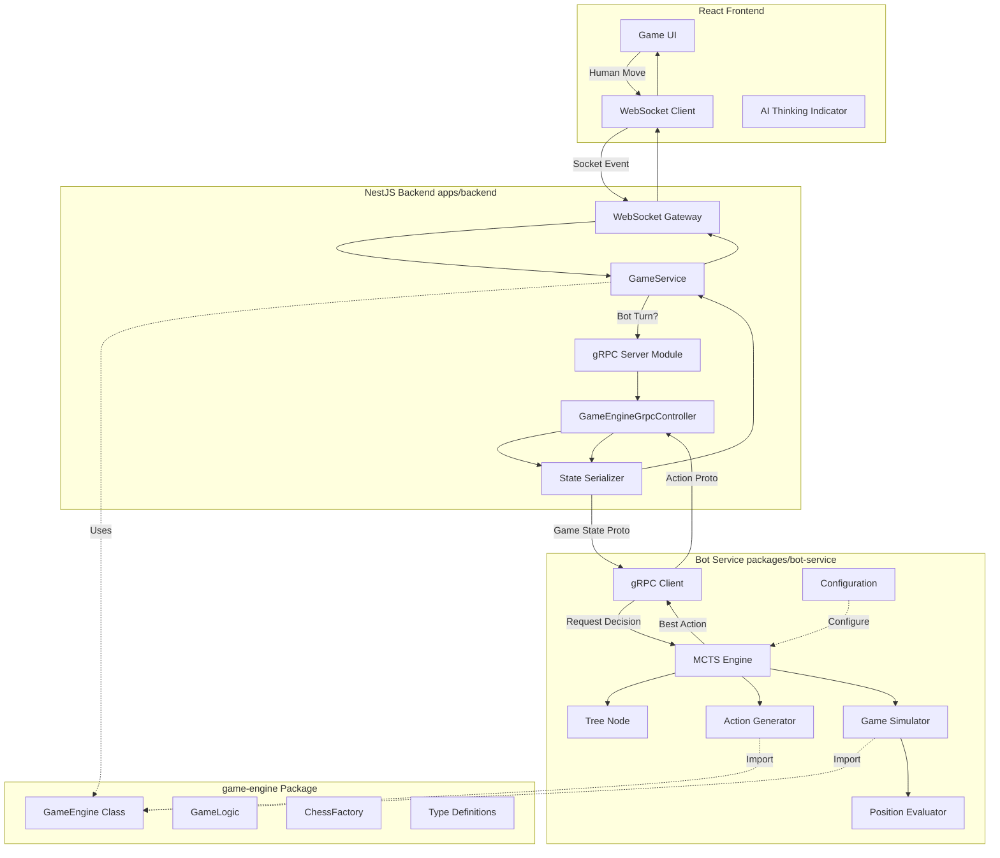

# LOL Chess AI Bot Architecture

**Version**: 1.0  
**Date**: December 29, 2025  
**Status**: Documentation Complete, Implementation Pending

---

## Table of Contents

1. [Introduction](#introduction)
2. [Architecture Overview](#architecture-overview)
3. [gRPC Protocol Definition](#grpc-protocol-definition)
4. [MCTS Algorithm Explanation](#mcts-algorithm-explanation)
5. [Bot Service Implementation](#bot-service-implementation)
6. [Backend Integration](#backend-integration)
7. [Action Generation Details](#action-generation-details)
8. [Simulation and Rollout Strategy](#simulation-and-rollout-strategy)
9. [Integration with Game Flow](#integration-with-game-flow)
10. [Configuration and Tuning](#configuration-and-tuning)
11. [Testing Strategy](#testing-strategy)
12. [Deployment](#deployment)
13. [Future Enhancements](#future-enhancements)

---

## 1. Introduction

### Overview

This document provides a comprehensive guide for implementing an AI bot opponent for LOL Chess using **Monte Carlo Tree Search (MCTS)**. The bot system is designed as a separate service that communicates with the game backend via gRPC, allowing for scalable, intelligent gameplay without coupling AI logic to the core game engine.

### Why MCTS?

Monte Carlo Tree Search was chosen for several key reasons:

1. **No Domain Knowledge Required**: Unlike traditional chess engines with handcrafted evaluation functions, MCTS learns optimal strategies through simulation and statistical sampling.

2. **Lookahead Planning**: MCTS excels at games with:
   - Large branching factors (many possible moves per turn)
   - Complex interactions (champion abilities, items, positioning)
   - Tactical depth (multi-turn sequences matter)

3. **Anytime Algorithm**: MCTS can be interrupted at any time and still provide a reasonable move, making it ideal for real-time gameplay with time constraints.

4. **Balances Exploration and Exploitation**: The UCB1 formula ensures the bot explores promising but unvisited moves while exploiting known good strategies.

5. **Handles Stochastic Elements**: LOL Chess has randomness (critical strikes, shop items). MCTS naturally handles this through repeated simulation.

### Technology Stack

- **Language**: TypeScript (Node.js)
  - Direct import of `@lolchess/game-engine` package
  - No serialization overhead for simulations
  - Type safety and code reuse

- **Communication**: gRPC with Protocol Buffers
  - Fast binary serialization
  - Strongly typed contracts
  - Bidirectional streaming support (future)

- **Infrastructure**: 
  - Standalone service (can run on separate hardware)
  - Docker containerization
  - Configurable via environment variables

### High-Level Flow

```
1. Human player makes move → Backend processes
2. Backend detects it's bot's turn
3. Backend sends game state to Bot Service via gRPC
4. Bot runs MCTS simulation (thousands of rollouts)
5. Bot returns best action
6. Backend processes bot action
7. Frontend displays updated board state
```

---

## 2. Architecture Overview

### System Architecture

The AI bot system consists of three main components that communicate to provide intelligent gameplay:



### Component Responsibilities

#### Frontend (React)
- **Responsibilities**:
  - Render game board and pieces
  - Handle human player input
  - Display "AI is thinking..." indicator during bot turns
  - Animate bot actions
  - Show game result
  
- **Key Files**:
  - `apps/frontend/src/components/GameBoard.tsx` - Main board component
  - `apps/frontend/src/pages/Home.tsx` - Game creation with "Play vs Bot" option

#### Backend (NestJS)
- **Responsibilities**:
  - Manage game state persistence (MongoDB)
  - Handle WebSocket connections
  - Detect when it's the bot's turn
  - Call Bot Service via gRPC
  - Process and validate all moves
  - Broadcast state updates to connected clients
  
- **Key Modules**:
  - `GameService` - Core game logic wrapper
  - `GameGateway` - WebSocket handler
  - `GameEngineGrpcModule` - gRPC server for bot communication
  - `GameEngineGrpcController` - RPC method implementations
  - `GameEngineGrpcSerializer` - State serialization/deserialization

#### Game Engine Package
- **Responsibilities**:
  - Pure game logic (framework-agnostic)
  - Action validation and processing
  - Deterministic simulations (seeded RNG)
  - Move/attack/skill generation
  - Game state queries
  
- **Key Classes**:
  - `GameEngine` - Main API
  - `GameLogic` - Processing logic
  - `ChessObject` - Base champion class
  - All type definitions

#### Bot Service
- **Responsibilities**:
  - Implement MCTS algorithm
  - Generate all possible actions
  - Simulate thousands of game outcomes
  - Evaluate positions heuristically
  - Return best action within time limit
  
- **Key Components**:
  - `MCTSEngine` - Core MCTS implementation
  - `TreeNode` - MCTS tree structure
  - `ActionGenerator` - Enumerate legal moves
  - `Simulator` - Fast game rollouts
  - `Evaluator` - Position scoring

### Data Flow

#### Human Player Turn
```
User Input → WebSocket → GameService → GameLogic.processGame() 
→ Validate → Update State → Save to DB/Redis 
→ Broadcast via WebSocket → Frontend Renders
```

#### Bot Player Turn
```
GameService detects bot turn 
→ Serialize game state to Protobuf 
→ gRPC call to BotService.getBotAction(state, timeLimit)
→ Bot runs MCTS (1000+ simulations)
→ Bot returns best EventPayload
→ Deserialize action
→ GameLogic.processGame() 
→ Update State → Broadcast → Frontend Renders
```

### Why Separate Service?

The bot runs as a separate service rather than integrated into the backend for several reasons:

1. **Language Flexibility**: Can be rewritten in Python later for ML integration without changing backend
2. **Scalability**: Bot computation can run on different hardware, scaled independently
3. **Isolation**: Bot crashes don't affect main game server
4. **Resource Management**: CPU-intensive MCTS doesn't block backend request handling
5. **Development**: Bot can be developed and tested independently
6. **Reusability**: Same bot can be used for replay analysis, training, etc.

### Communication Protocol

**gRPC** was chosen over alternatives for these reasons:

| Feature | gRPC | REST | WebSocket |
|---------|------|------|-----------|
| Performance | Fast (binary) | Slower (JSON) | Fast (binary) |
| Type Safety | Strong (Protobuf) | Weak | None |
| Streaming | Yes | No | Yes |
| Language Support | Excellent | Universal | Good |
| Request/Response | Native | Native | Manual |

For MCTS, which requires:
- Sending complex game state
- Receiving action decisions
- Potentially streaming simulations (future)

gRPC provides the best balance of performance, type safety, and developer experience.

---

## 3. gRPC Protocol Definition

### Protocol Buffer Schema

Create `proto/game-engine.proto`:

```protobuf
syntax = "proto3";

package lolchess;

// ============================================================================
// Core Data Types
// ============================================================================

message Square {
  int32 x = 1;
  int32 y = 2;
}

message ChessStats {
  int32 hp = 1;
  int32 maxHp = 2;
  int32 attack = 3;
  int32 armor = 4;
  int32 magicResist = 5;
  int32 speed = 6;
  AttackRange attackRange = 7;
  int32 criticalChance = 8;
  int32 criticalDamage = 9;
}

message AttackRange {
  int32 range = 1;
  string type = 2; // "melee" or "ranged"
}

message Item {
  string id = 1;
  string name = 2;
  ChessStats statBonus = 3;
  string description = 4;
  int32 cost = 5;
}

message Skill {
  string name = 1;
  string description = 2;
  int32 cooldown = 3;
  int32 currentCooldown = 4;
  AttackRange attackRange = 5;
  string targetTypes = 6; // "enemy", "ally", "none", "square"
  repeated string tags = 7;
}

message Debuff {
  string id = 1;
  string name = 2;
  int32 duration = 3;
  string type = 4; // "stun", "slow", "disarm", etc.
  string sourceChessId = 5;
}

message Shield {
  string id = 1;
  int32 amount = 2;
  int32 duration = 3;
  string sourceChessId = 4;
}

message Chess {
  string id = 1;
  string name = 2;
  Square position = 3;
  bool blue = 4;
  string ownerId = 5;
  ChessStats stats = 6;
  Skill skill = 7;
  repeated Item items = 8;
  repeated Debuff debuffs = 9;
  repeated Shield shields = 10;
  bool cannotAttack = 11;
  bool cannotMoveBackward = 12;
  bool hasMovedBefore = 13;
  int32 deadAtRound = 14;
}

message Player {
  string userId = 1;
  string username = 2;
  int32 gold = 3;
  string side = 4; // "blue" or "red"
  repeated string selectedChampions = 5;
  repeated string bannedChampions = 6;
}

message GameSettings {
  int32 roundTime = 1;
  int32 startingGold = 2;
}

message GameStateMessage {
  string name = 1;
  string status = 2; // "waiting", "in_progress", "finished"
  repeated Player players = 3;
  int32 maxPlayers = 4;
  int32 currentRound = 5;
  GameSettings gameSettings = 6;
  string winner = 7;
  string phase = 8; // "gameplay"
  string bluePlayer = 9;
  string redPlayer = 10;
  repeated Chess board = 11;
  bool hasBoughtItemThisTurn = 12;
  bool hasPerformedActionThisTurn = 13;
  repeated string shopItems = 14;
  int32 shopRefreshRound = 15;
  int32 rngSeed = 16;
  int32 rngState = 17;
}

// ============================================================================
// Action/Event Messages
// ============================================================================

message EventPayloadMessage {
  string playerId = 1;
  string event = 2; // "move_chess", "attack_chess", "skill", "buy_item"
  Square casterPosition = 3;
  Square targetPosition = 4;
  string itemId = 5; // For BUY_ITEM
  string targetChampionId = 6; // For BUY_ITEM
}

// ============================================================================
// Service Request/Response Messages
// ============================================================================

message GetBotActionRequest {
  GameStateMessage gameState = 1;
  string playerId = 2;
  int32 timeLimitMs = 3; // Time limit for decision (default 5000ms)
}

message GetBotActionResponse {
  EventPayloadMessage action = 1;
  int32 simulationsRun = 2;
  float confidence = 3; // Win probability estimate [0-1]
  int32 timeElapsedMs = 4;
}

message GetPossibleActionsRequest {
  GameStateMessage gameState = 1;
  string playerId = 2;
}

message GetPossibleActionsResponse {
  repeated EventPayloadMessage actions = 1;
  int32 totalActions = 2;
}

message ValidateActionRequest {
  GameStateMessage gameState = 1;
  EventPayloadMessage action = 2;
}

message ValidateActionResponse {
  bool valid = 1;
  string error = 2; // Error message if invalid
}

message SimulateActionRequest {
  GameStateMessage gameState = 1;
  EventPayloadMessage action = 2;
}

message SimulateActionResponse {
  GameStateMessage resultState = 1;
  bool success = 2;
  string error = 3;
}

// ============================================================================
// Service Definition
// ============================================================================

service GameEngineService {
  // Main endpoint: Get bot's chosen action for current game state
  rpc GetBotAction(GetBotActionRequest) returns (GetBotActionResponse);
  
  // Helper: Get all legal actions for a player
  rpc GetPossibleActions(GetPossibleActionsRequest) returns (GetPossibleActionsResponse);
  
  // Helper: Check if an action is valid
  rpc ValidateAction(ValidateActionRequest) returns (ValidateActionResponse);
  
  // Helper: Simulate what happens after an action (for MCTS rollouts)
  rpc SimulateAction(SimulateActionRequest) returns (SimulateActionResponse);
}
```

### Message Design Rationale

1. **Complete State Transfer**: `GameStateMessage` contains the entire game state so the bot can make decisions independently without querying the backend multiple times.

2. **Nested Messages**: Complex types like `Chess`, `Player`, `Item` are separate messages for clarity and reusability.

3. **Primitive Types**: Use `int32`, `string`, `bool` rather than complex types to ensure cross-language compatibility.

4. **Optional Fields**: Proto3 makes all fields optional by default. Missing fields get default values (0, "", false, empty array).

5. **Metadata in Response**: `GetBotActionResponse` includes `simulationsRun`, `confidence`, and `timeElapsedMs` for debugging and UI display.

### Serialization Considerations

**Challenges**:
- TypeScript `Game` has complex nested objects (Chess[], Items[], Debuffs[])
- Some fields are optional (skill?, winner?)
- Arrays of objects need deep conversion

**Solutions**:
- Write comprehensive serialization utilities in `GameEngineGrpcSerializer`
- Handle undefined/null values explicitly
- Test serialization round-trips (TS → Proto → TS should be identical)

### Payload Size Optimization

**⚠️ Performance Risk**: If `GameStateMessage` includes unnecessary metadata, payloads can exceed 100KB. Sending this 50 times/second will saturate network bandwidth.

**Optimization Strategy**:

**1. Strip UI-Only Fields**:
```typescript
serializeChess(chess: Chess): ChessMessage {
  return {
    id: chess.id,
    name: chess.name,
    position: chess.position,
    stats: this.serializeStats(chess.stats),
    skill: chess.skill ? this.serializeSkill(chess.skill) : undefined,
    // OMIT: descriptions, asset URLs, animation data, sound effects
    // OMIT: skill.description, skill.visualEffects
  };
}
```

**2. Compress Repeated Data**:
- Instead of sending full `Item` objects with descriptions, send only `itemId` strings
- Bot can look up item stats locally from `@lolchess/game-engine`

**3. Use Protobuf Efficiently**:
- Mark rarely-used fields as `optional` so they're not serialized when absent
- Use `int32` instead of `string` for enums where possible

**Expected Payload Sizes**:
- Early game (8 pieces, minimal items): ~5-10 KB
- Mid game (7 pieces, some items): ~10-15 KB
- Late game (4 pieces, full items): ~8-12 KB

**Target**: Keep payloads under 20 KB for fast serialization/deserialization.

### Example Request/Response Flow

#### Bot Action Request
```
Backend → Bot Service:
{
  gameState: { /* full game state */ },
  playerId: "bot-player-1",
  timeLimitMs: 5000
}
```

#### Bot Action Response
```
Bot Service → Backend:
{
  action: {
    playerId: "bot-player-1",
    event: "attack_chess",
    casterPosition: { x: 3, y: 2 },
    targetPosition: { x: 4, y: 3 }
  },
  simulationsRun: 1247,
  confidence: 0.68,
  timeElapsedMs: 4823
}
```

---

## 4. MCTS Algorithm Explanation

### Monte Carlo Tree Search Fundamentals

Monte Carlo Tree Search is a heuristic search algorithm that builds a decision tree incrementally through random sampling. Unlike minimax (which exhaustively explores the game tree), MCTS uses statistical sampling to focus computational effort on promising paths.

### Core Concepts

**Game Tree**: Each node represents a game state, edges represent actions

**Exploration vs Exploitation**: 
- **Exploitation**: Choose actions that have led to wins in past simulations
- **Exploration**: Try actions that haven't been simulated much yet

**UCB1 Formula**: Balances exploration and exploitation:
```
UCB1(node) = (wins / visits) + C * sqrt(ln(parent.visits) / visits)
              ↑ exploitation      ↑ exploration
```

Where `C` is the exploration constant (typically √2 ≈ 1.414)

### Four Phases of MCTS

```
┌─────────────────────────────────────────────────────────────┐
│                     MCTS Main Loop                          │
│                                                             │
│  for i = 1 to iteration_budget:                            │
│    1. Selection    → Navigate tree using UCB1              │
│    2. Expansion    → Add new child node                    │
│    3. Simulation   → Play out game randomly                │
│    4. Backpropagation → Update all ancestors              │
│                                                             │
│  return: Most visited child of root                        │
└─────────────────────────────────────────────────────────────┘
```

#### Phase 1: Selection

**Goal**: Start from root, traverse the tree to find a leaf node to expand

**Algorithm**:
```typescript
function select(node: MCTSNode): MCTSNode {
  while (!node.isTerminal() && node.isFullyExpanded()) {
    // All children have been tried, pick best one using UCB1
    node = node.getBestChild(EXPLORATION_CONSTANT);
  }
  return node;
}
```

**UCB1 Implementation**:
```typescript
getBestChild(C: number): MCTSNode {
  let bestScore = -Infinity;
  let bestChild: MCTSNode | null = null;
  
  for (const child of this.children) {
    // Exploitation term: average reward
    const exploitation = child.totalReward / child.visits;
    
    // Exploration term: prioritize less-visited nodes
    const exploration = C * Math.sqrt(Math.log(this.visits) / child.visits);
    
    const ucb1Score = exploitation + exploration;
    
    if (ucb1Score > bestScore) {
      bestScore = ucb1Score;
      bestChild = child;
    }
  }
  
  return bestChild!;
}
```

#### Phase 2: Expansion

**Goal**: Add one new child node for an unexplored action

**Algorithm**:
```typescript
function expand(node: MCTSNode): MCTSNode {
  // Pick a random untried action
  const action = node.untriedActions.pop()!;
  
  // Clone the game state and apply the action
  const newState = cloneGameState(node.state);
  gameEngine.processAction(newState, action);
  
  // Create new child node
  const childNode = new MCTSNode({
    state: newState,
    action: action,
    parent: node,
    playerId: getOpponentId(node.playerId)
  });
  
  node.children.push(childNode);
  return childNode;
}
```

#### Phase 3: Simulation (Rollout)

**Goal**: From the new node, play the game to completion using a fast policy

**Fast Rollout Policy** (heuristic, not random):
```typescript
function simulate(state: Game, maxDepth: number): number {
  let currentState = cloneGameState(state);
  let depth = 0;
  
  while (!gameEngine.isGameOver(currentState) && depth < maxDepth) {
    const currentPlayer = getCurrentPlayerId(currentState);
    const actions = getAllPossibleActions(currentState, currentPlayer);
    
    if (actions.length === 0) break;
    
    // Use simple heuristic policy instead of pure random:
    // 1. Prioritize attacks over moves
    // 2. Use skills when available
    // 3. Buy items if gold available
    const action = selectHeuristicAction(actions, currentState);
    
    gameEngine.processAction(currentState, action);
    depth++;
  }
  
  // Return reward from perspective of original player
  return evaluateTerminalState(currentState, originalPlayerId);
}
```

**Heuristic Action Selection**:
```typescript
function selectHeuristicAction(actions: EventPayload[], state: Game): EventPayload {
  // Priority 1: Attacks that can kill enemy
  const lethalAttacks = actions.filter(a => 
    a.event === "attack_chess" && canKillTarget(state, a)
  );
  if (lethalAttacks.length > 0) {
    return lethalAttacks[Math.floor(Math.random() * lethalAttacks.length)];
  }
  
  // Priority 2: Skills if available
  const skills = actions.filter(a => a.event === "skill");
  if (skills.length > 0 && Math.random() < 0.6) {
    return skills[Math.floor(Math.random() * skills.length)];
  }
  
  // Priority 3: Any attack
  const attacks = actions.filter(a => a.event === "attack_chess");
  if (attacks.length > 0 && Math.random() < 0.7) {
    return attacks[Math.floor(Math.random() * attacks.length)];
  }
  
  // Priority 4: Buy good items
  const itemPurchases = actions.filter(a => 
    a.event === "buy_item" && isGoodItem(a.itemId)
  );
  if (itemPurchases.length > 0 && Math.random() < 0.3) {
    return itemPurchases[Math.floor(Math.random() * itemPurchases.length)];
  }
  
  // Default: Random action
  return actions[Math.floor(Math.random() * actions.length)];
}
```

#### Phase 4: Backpropagation

**Goal**: Update visit counts and rewards for all nodes from leaf to root

**Algorithm**:
```typescript
function backpropagate(node: MCTSNode, reward: number): void {
  let current: MCTSNode | null = node;
  
  while (current !== null) {
    current.visits++;
    
    // Reward is from perspective of the player who made the move
    // If this node's player is the one who got the reward, add it
    // Otherwise, subtract it (zero-sum game)
    if (current.playerId === node.playerId) {
      current.totalReward += reward;
    } else {
      current.totalReward += (1 - reward); // Invert for opponent
    }
    
    current = current.parent;
  }
}
```

**Terminal State Evaluation**:
```typescript
function evaluateTerminalState(state: Game, playerId: string): number {
  if (!gameEngine.isGameOver(state)) {
    // If max depth reached, use heuristic evaluation
    return normalizeScore(evaluatePosition(state, playerId));
  }
  
  const winner = gameEngine.getWinner(state);
  
  if (winner === playerId) {
    return 1.0; // Win
  } else if (winner === null) {
    return 0.5; // Draw
  } else {
    return 0.0; // Loss
  }
}
```

### Complete MCTS Algorithm

```typescript
class MCTSEngine {
  private explorationConstant: number = 1.414; // √2
  
  search(
    rootState: Game, 
    playerId: string, 
    config: MCTSConfig
  ): EventPayload {
    const rootNode = new MCTSNode({
      state: rootState,
      action: null,
      parent: null,
      playerId: playerId
    });
    
    const startTime = Date.now();
    let iterations = 0;
    
    // Run MCTS until time limit or iteration budget
    while (
      iterations < config.iterationBudget &&
      Date.now() - startTime < config.timeLimitMs
    ) {
      // 1. Selection: Navigate to leaf using UCB1
      let node = this.select(rootNode);
      
      // 2. Expansion: Add new child if not terminal
      if (!gameEngine.isGameOver(node.state) && node.hasUntriedActions()) {
        node = this.expand(node);
      }
      
      // 3. Simulation: Play out to terminal state
      const reward = this.simulate(node.state, config.simulationDepthLimit);
      
      // 4. Backpropagation: Update all ancestors
      this.backpropagate(node, reward);
      
      iterations++;
    }
    
    // Return action with highest visit count (most explored)
    const bestChild = this.getMostVisitedChild(rootNode);
    
    console.log(`MCTS completed: ${iterations} iterations in ${Date.now() - startTime}ms`);
    console.log(`Best action: ${bestChild.action.event} with ${bestChild.visits} visits`);
    console.log(`Win rate: ${(bestChild.totalReward / bestChild.visits * 100).toFixed(1)}%`);
    
    return bestChild.action!;
  }
  
  private getMostVisitedChild(node: MCTSNode): MCTSNode {
    return node.children.reduce((best, child) => 
      child.visits > best.visits ? child : best
    );
  }
}
```

### Tree Node Structure

```typescript
interface MCTSNodeConfig {
  state: Game;
  action: EventPayload | null;
  parent: MCTSNode | null;
  playerId: string;
}

class MCTSNode {
  state: Game;
  action: EventPayload | null; // Action that led to this state
  parent: MCTSNode | null;
  children: MCTSNode[];
  visits: number;
  totalReward: number;
  untriedActions: EventPayload[];
  playerId: string; // Player who made the action
  
  constructor(config: MCTSNodeConfig) {
    this.state = config.state;
    this.action = config.action;
    this.parent = config.parent;
    this.playerId = config.playerId;
    this.children = [];
    this.visits = 0;
    this.totalReward = 0;
    
    // Initialize untried actions
    if (!gameEngine.isGameOver(this.state)) {
      this.untriedActions = getAllPossibleActions(this.state, this.playerId);
    } else {
      this.untriedActions = [];
    }
  }
  
  isFullyExpanded(): boolean {
    return this.untriedActions.length === 0;
  }
  
  hasUntriedActions(): boolean {
    return this.untriedActions.length > 0;
  }
  
  isTerminal(): boolean {
    return gameEngine.isGameOver(this.state);
  }
  
  getBestChild(explorationConstant: number): MCTSNode {
    // UCB1 implementation (see above)
    // ...
  }
}
```

### MCTS Configuration

```typescript
interface MCTSConfig {
  iterationBudget: number;        // Max iterations (e.g., 1000)
  timeLimitMs: number;            // Max time in milliseconds (e.g., 5000)
  explorationConstant: number;    // UCB1 C value (√2 ≈ 1.414)
  simulationDepthLimit: number;   // Max playout depth (e.g., 50)
  useHeuristics: boolean;         // Use heuristic rollouts vs random
}
```

### Performance Characteristics

**Time Complexity**: O(iterations * actions * depth)
- `iterations`: Number of MCTS simulations (1000)
- `actions`: Average branching factor (~20-50)
- `depth`: Average game depth to terminal state (~20-30)

**Space Complexity**: O(iterations)
- Tree stores one node per simulation

**Typical Performance**:
- 1000 iterations in ~5 seconds
- ~10,000 game state evaluations
- Tree size: ~1000 nodes

### Critical Performance Bottleneck: State Cloning

**⚠️ WARNING**: The biggest performance bottleneck in MCTS is `cloneGameState()`.

**The Problem**:
```typescript
// This happens THOUSANDS of times per decision
const newState = cloneGameState(node.state);  // Expensive!
gameEngine.processAction(newState, action);
```

In JavaScript/TypeScript, deep cloning complex objects (Game with Chess[], Items[], Debuffs[]) is CPU-intensive. If cloning takes 5ms but action processing takes 1ms, 83% of your compute time is wasted on memory allocation.

**Optimization Strategies**:

**1. Undo/Revert Pattern (Best)**
Instead of cloning before each action, apply the action and then undo it:

```typescript
// Instead of: Clone → Apply → Simulate → Discard
// Do: Apply → Simulate → Undo

function simulateWithUndo(state: Game, action: EventPayload): number {
  const undoInfo = applyAction(state, action);  // Returns undo information
  const reward = evaluatePosition(state);
  revertAction(state, undoInfo);  // Restore original state
  return reward;
}
```

**2. Immutable Data Structures (Alternative)**
Use Immer or similar libraries for structural sharing:

```typescript
import produce from 'immer';

const newState = produce(state, draft => {
  draft.board[0].stats.hp -= 10;  // Only copies the modified parts
});
```

**3. Lightweight State Representation (Advanced)**
Store only the minimal state needed for simulations:

```typescript
// Full Game object: ~10KB
// Lightweight state: ~1KB (positions, HP, key flags only)
interface LightweightState {
  pieces: Array<{ pos: Square, hp: number, attack: number }>;
  currentRound: number;
  playerGold: number[];
}
```

**Recommendation**: Start with `cloneGameState` for V1. Profile the bot to confirm cloning is the bottleneck, then implement undo/revert if needed. Don't prematurely optimize.

### Why MCTS Works for LOL Chess

1. **High Branching Factor**: LOL Chess has many possible moves per turn (8 pieces × ~5 moves each + skills + items = 50+ actions). MCTS handles this well through sampling.

2. **Tactical Depth**: Multi-turn sequences matter (positioning, skill cooldowns, item builds). MCTS explores these naturally.

3. **Stochastic Elements**: Critical strikes, shop items are random. MCTS averages over many simulations to handle uncertainty.

4. **Complex Evaluation**: Writing a good evaluation function is hard. MCTS learns through simulation what positions lead to wins.

5. **Anytime Nature**: Can stop MCTS early if time constrained and still get a reasonable move.

### Handling Stochasticity in MCTS

**Critical Challenge**: MCTS assumes a deterministic environment. If the bot simulates an action but randomness changes the outcome (critical strikes, shop rolls), simulations may be invalid.

**Solution Options**:

**Option A: Deterministic MCTS (Recommended for V1)**
- The bot receives `rngSeed` and `rngState` in `GameStateMessage`
- Uses the game engine's seeded RNG to predict exact outcomes
- Pro: Simpler implementation, stronger bot (knows exactly what will happen)
- Con: Bot is "omniscient" about random events

```typescript
// Bot can predict exactly if an attack will crit
const rng = new SeededRandom(game.rngState);
const willCrit = rng.chance(piece.stats.criticalChance);
```

**Option B: Perfect Information Monte Carlo (PIMC) (Future Enhancement)**
- Randomize hidden information at the start of each rollout
- Average out luck factor across many simulations
- Pro: More "fair," doesn't cheat with RNG knowledge
- Con: More complex, requires multiple rollouts per position

**Implementation Note**: For V1, use **Option A (Deterministic)**. The bot will be stronger and simpler to implement. The game engine's seeded RNG makes this straightforward.

---

## 5. Bot Service Implementation

### Directory Structure

Create `packages/bot-service/` with the following structure:

```
packages/bot-service/
├── package.json
├── tsconfig.json
├── .env.example
├── Dockerfile
├── src/
│   ├── index.ts                    # Main entry point
│   ├── grpc-client.ts              # gRPC client for backend communication
│   ├── mcts/
│   │   ├── MCTSEngine.ts           # Core MCTS algorithm (~200 lines)
│   │   ├── TreeNode.ts             # MCTS tree node structure (~100 lines)
│   │   ├── Simulator.ts            # Game simulation/rollout (~150 lines)
│   │   └── Evaluator.ts            # Position evaluation heuristics (~200 lines)
│   ├── strategies/
│   │   ├── ActionGenerator.ts      # Enumerate all possible actions (~200 lines)
│   │   ├── Heuristics.ts           # Action selection heuristics (~150 lines)
│   │   └── Opening.ts              # Opening book (optional, future)
│   ├── utils/
│   │   ├── logger.ts               # Logging utility
│   │   └── config.ts               # Configuration management
│   └── types/
│       └── index.ts                # Re-export game-engine types
└── config/
    └── bot-config.json             # Bot configuration file
```

### Package Setup

**`package.json`**:
```json
{
  "name": "@lolchess/bot-service",
  "version": "1.0.0",
  "description": "AI bot service for LOL Chess using MCTS",
  "main": "dist/index.js",
  "scripts": {
    "build": "tsc",
    "start": "node dist/index.js",
    "dev": "ts-node src/index.ts",
    "test": "jest"
  },
  "dependencies": {
    "@lolchess/game-engine": "*",
    "@grpc/grpc-js": "^1.9.0",
    "@grpc/proto-loader": "^0.7.0",
    "dotenv": "^16.0.0"
  },
  "devDependencies": {
    "@types/node": "^20.0.0",
    "typescript": "^5.0.0",
    "ts-node": "^10.0.0",
    "jest": "^29.0.0",
    "@types/jest": "^29.0.0"
  }
}
```

**`tsconfig.json`**:
```json
{
  "compilerOptions": {
    "target": "ES2020",
    "module": "commonjs",
    "lib": ["ES2020"],
    "outDir": "./dist",
    "rootDir": "./src",
    "strict": true,
    "esModuleInterop": true,
    "skipLibCheck": true,
    "forceConsistentCasingInFileNames": true,
    "resolveJsonModule": true
  },
  "include": ["src/**/*"],
  "exclude": ["node_modules", "dist"]
}
```

### Why TypeScript over Python?

**Advantages**:
1. **Direct Import**: Can import `@lolchess/game-engine` package directly without gRPC overhead for simulations
2. **Type Safety**: Full TypeScript type checking with game engine types
3. **Code Reuse**: Share utilities, types, and logic with main codebase
4. **Performance**: V8 engine is fast enough for MCTS (no need for numpy)
5. **Simplified Stack**: One language for entire project

**Disadvantages**:
- Python has better ML libraries (if we want neural networks later)
- Python's scientific computing stack (numpy) might be faster for matrix operations

**Decision**: Use TypeScript for now. Can port to Python later if ML integration is needed.

### Core Classes

#### TreeNode Class (`src/mcts/TreeNode.ts`)

```typescript
import { Game, EventPayload } from "@lolchess/game-engine";

export interface MCTSNodeConfig {
  state: Game;
  action: EventPayload | null;
  parent: MCTSNode | null;
  playerId: string;
}

export class MCTSNode {
  state: Game;
  action: EventPayload | null;
  parent: MCTSNode | null;
  children: MCTSNode[];
  visits: number;
  totalReward: number;
  untriedActions: EventPayload[];
  playerId: string;

  constructor(config: MCTSNodeConfig) {
    this.state = config.state;
    this.action = config.action;
    this.parent = config.parent;
    this.playerId = config.playerId;
    this.children = [];
    this.visits = 0;
    this.totalReward = 0;
    this.untriedActions = [];
  }

  isFullyExpanded(): boolean {
    return this.untriedActions.length === 0 && this.children.length > 0;
  }

  hasUntriedActions(): boolean {
    return this.untriedActions.length > 0;
  }

  isTerminal(): boolean {
    const { isGameOver } = require("@lolchess/game-engine");
    return isGameOver(this.state);
  }

  getBestChild(explorationConstant: number): MCTSNode {
    let bestScore = -Infinity;
    let bestChild: MCTSNode = this.children[0];

    for (const child of this.children) {
      if (child.visits === 0) continue;

      const exploitation = child.totalReward / child.visits;
      const exploration =
        explorationConstant * Math.sqrt(Math.log(this.visits) / child.visits);
      const ucb1Score = exploitation + exploration;

      if (ucb1Score > bestScore) {
        bestScore = ucb1Score;
        bestChild = child;
      }
    }

    return bestChild;
  }

  getMostVisitedChild(): MCTSNode {
    return this.children.reduce((best, child) =>
      child.visits > best.visits ? child : best
    );
  }

  getAverageReward(): number {
    return this.visits > 0 ? this.totalReward / this.visits : 0;
  }
}
```

#### MCTSEngine Class (`src/mcts/MCTSEngine.ts`)

```typescript
import { Game, EventPayload, cloneGameState, gameEngine } from "@lolchess/game-engine";
import { MCTSNode } from "./TreeNode";
import { ActionGenerator } from "../strategies/ActionGenerator";
import { Simulator } from "./Simulator";
import { Logger } from "../utils/logger";

export interface MCTSConfig {
  iterationBudget: number;
  timeLimitMs: number;
  explorationConstant: number;
  simulationDepthLimit: number;
  useHeuristics: boolean;
}

export class MCTSEngine {
  private config: MCTSConfig;
  private actionGenerator: ActionGenerator;
  private simulator: Simulator;
  private logger: Logger;

  constructor(config: MCTSConfig) {
    this.config = config;
    this.actionGenerator = new ActionGenerator();
    this.simulator = new Simulator(config.simulationDepthLimit, config.useHeuristics);
    this.logger = new Logger("MCTSEngine");
  }

  search(rootState: Game, playerId: string): EventPayload {
    const rootNode = new MCTSNode({
      state: cloneGameState(rootState),
      action: null,
      parent: null,
      playerId: playerId,
    });

    // Initialize root node's untried actions
    rootNode.untriedActions = this.actionGenerator.getAllPossibleActions(
      rootNode.state,
      playerId
    );

    const startTime = Date.now();
    let iterations = 0;

    // Main MCTS loop
    while (
      iterations < this.config.iterationBudget &&
      Date.now() - startTime < this.config.timeLimitMs
    ) {
      // 1. Selection
      let node = this.select(rootNode);

      // 2. Expansion
      if (!node.isTerminal() && node.hasUntriedActions()) {
        node = this.expand(node);
      }

      // 3. Simulation
      const reward = this.simulator.simulate(node.state, playerId);

      // 4. Backpropagation
      this.backpropagate(node, reward, playerId);

      iterations++;
    }

    const timeElapsed = Date.now() - startTime;
    const bestChild = rootNode.getMostVisitedChild();

    this.logger.info(
      `MCTS completed: ${iterations} iterations in ${timeElapsed}ms`
    );
    this.logger.info(
      `Best action: ${JSON.stringify(bestChild.action)} with ${bestChild.visits} visits`
    );
    this.logger.info(
      `Win rate: ${(bestChild.getAverageReward() * 100).toFixed(1)}%`
    );

    return bestChild.action!;
  }

  private select(node: MCTSNode): MCTSNode {
    while (!node.isTerminal() && node.isFullyExpanded()) {
      node = node.getBestChild(this.config.explorationConstant);
    }
    return node;
  }

  private expand(node: MCTSNode): MCTSNode {
    // Pick random untried action
    const actionIndex = Math.floor(Math.random() * node.untriedActions.length);
    const action = node.untriedActions.splice(actionIndex, 1)[0];

    // Apply action to get new state
    const newState = cloneGameState(node.state);
    const result = gameEngine.processAction(newState, action);

    if (!result.success) {
      this.logger.warn(`Failed to expand: ${result.error}`);
      return node;
    }

    // Determine next player
    const { getCurrentPlayerId } = require("@lolchess/game-engine");
    const nextPlayerId = getCurrentPlayerId(result.game) || node.playerId;

    // Create new child node
    const childNode = new MCTSNode({
      state: result.game,
      action: action,
      parent: node,
      playerId: nextPlayerId,
    });

    // Initialize child's untried actions
    if (!childNode.isTerminal()) {
      childNode.untriedActions = this.actionGenerator.getAllPossibleActions(
        childNode.state,
        nextPlayerId
      );
    }

    node.children.push(childNode);
    return childNode;
  }

  private backpropagate(node: MCTSNode, reward: number, originalPlayerId: string): void {
    let current: MCTSNode | null = node;

    while (current !== null) {
      current.visits++;

      // Reward is from perspective of originalPlayerId
      // If current node is that player's turn, add reward
      // Otherwise, add inverted reward (zero-sum game)
      if (current.playerId === originalPlayerId) {
        current.totalReward += reward;
      } else {
        current.totalReward += 1 - reward;
      }

      current = current.parent;
    }
  }
}
```

#### Simulator Class (`src/mcts/Simulator.ts`)

```typescript
import {
  Game,
  EventPayload,
  cloneGameState,
  gameEngine,
  getCurrentPlayerId,
  isGameOver,
  getWinner,
} from "@lolchess/game-engine";
import { ActionGenerator } from "../strategies/ActionGenerator";
import { selectHeuristicAction } from "../strategies/Heuristics";
import { Evaluator } from "./Evaluator";

export class Simulator {
  private maxDepth: number;
  private useHeuristics: boolean;
  private actionGenerator: ActionGenerator;
  private evaluator: Evaluator;

  constructor(maxDepth: number, useHeuristics: boolean) {
    this.maxDepth = maxDepth;
    this.useHeuristics = useHeuristics;
    this.actionGenerator = new ActionGenerator();
    this.evaluator = new Evaluator();
  }

  simulate(state: Game, playerId: string): number {
    let currentState = cloneGameState(state);
    let depth = 0;

    // Play out game until terminal or max depth
    while (!isGameOver(currentState) && depth < this.maxDepth) {
      const currentPlayerId = getCurrentPlayerId(currentState);
      if (!currentPlayerId) break;

      const actions = this.actionGenerator.getAllPossibleActions(
        currentState,
        currentPlayerId
      );

      if (actions.length === 0) break;

      // Select action (heuristic or random)
      const action = this.useHeuristics
        ? selectHeuristicAction(actions, currentState, currentPlayerId)
        : actions[Math.floor(Math.random() * actions.length)];

      // Apply action
      const result = gameEngine.processAction(currentState, action);
      if (!result.success) break;

      currentState = result.game;
      depth++;
    }

    // Evaluate terminal state
    return this.evaluateTerminalState(currentState, playerId);
  }

  private evaluateTerminalState(state: Game, playerId: string): number {
    if (!isGameOver(state)) {
      // Max depth reached, use heuristic evaluation
      const score = this.evaluator.evaluatePosition(state, playerId);
      // Normalize to [0, 1]
      return (score + 1) / 2;
    }

    const winner = getWinner(state);

    if (winner === playerId) {
      return 1.0; // Win
    } else if (winner === null) {
      return 0.5; // Draw
    } else {
      return 0.0; // Loss
    }
  }
}
```

#### Evaluator Class (`src/mcts/Evaluator.ts`)

```typescript
import { Game, Chess, getPlayerPieces, getCurrentPlayerId } from "@lolchess/game-engine";

export class Evaluator {
  evaluatePosition(game: Game, playerId: string): number {
    const playerPieces = getPlayerPieces(game, playerId);
    const opponentId = this.getOpponentId(game, playerId);
    const opponentPieces = getPlayerPieces(game, opponentId);

    let score = 0;

    // Material evaluation
    score += this.evaluateMaterial(playerPieces);
    score -= this.evaluateMaterial(opponentPieces);

    // Position evaluation
    score += this.evaluatePositioning(playerPieces, game.bluePlayer === playerId);
    score -= this.evaluatePositioning(opponentPieces, game.bluePlayer !== playerId);

    // Item advantage
    score += this.evaluateItems(playerPieces);
    score -= this.evaluateItems(opponentPieces);

    // Normalize to [-1, 1]
    return Math.tanh(score / 100);
  }

  private evaluateMaterial(pieces: Chess[]): number {
    let material = 0;

    for (const piece of pieces) {
      // HP value
      material += piece.stats.hp * 0.1;

      // Attack value
      material += piece.stats.attack * 2;

      // Defensive stats
      material += piece.stats.armor * 0.5;
      material += piece.stats.magicResist * 0.5;

      // Speed bonus
      material += piece.stats.speed * 1;
    }

    return material;
  }

  private evaluatePositioning(pieces: Chess[], isBlue: boolean): number {
    let positionScore = 0;

    for (const piece of pieces) {
      // Central control (pieces near center are better)
      const centerDistance = Math.abs(piece.position.x - 3.5) + Math.abs(piece.position.y - 3.5);
      positionScore += (7 - centerDistance) * 0.5;

      // Forward progress (pieces closer to enemy base)
      if (isBlue) {
        positionScore += piece.position.x * 0.3;
      } else {
        positionScore += (7 - piece.position.x) * 0.3;
      }

      // Penalize pieces that haven't moved
      if (!piece.hasMovedBefore) {
        positionScore -= 1;
      }
    }

    return positionScore;
  }

  private evaluateItems(pieces: Chess[]): number {
    let itemScore = 0;

    for (const piece of pieces) {
      // Each item is worth points
      itemScore += piece.items.length * 5;

      // Higher cost items are better
      for (const item of piece.items) {
        itemScore += item.cost * 0.5;
      }
    }

    return itemScore;
  }

  private getOpponentId(game: Game, playerId: string): string {
    return playerId === game.bluePlayer ? game.redPlayer! : game.bluePlayer!;
  }
}
```

### Configuration Management

**`src/utils/config.ts`**:
```typescript
export interface BotConfig {
  mcts: {
    iterationBudget: number;
    timeLimitMs: number;
    explorationConstant: number;
    simulationDepthLimit: number;
    useHeuristics: boolean;
  };
  grpc: {
    backendHost: string;
    backendPort: number;
  };
  logging: {
    level: "debug" | "info" | "warn" | "error";
  };
}

export const defaultConfig: BotConfig = {
  mcts: {
    iterationBudget: 1000,
    timeLimitMs: 5000,
    explorationConstant: 1.414,
    simulationDepthLimit: 50,
    useHeuristics: true,
  },
  grpc: {
    backendHost: process.env.BACKEND_HOST || "localhost",
    backendPort: parseInt(process.env.BACKEND_PORT || "50051"),
  },
  logging: {
    level: (process.env.LOG_LEVEL as any) || "info",
  },
};
```

**`config/bot-config.json`**:
```json
{
  "mcts": {
    "iterationBudget": 1000,
    "timeLimitMs": 5000,
    "explorationConstant": 1.414,
    "simulationDepthLimit": 50,
    "useHeuristics": true
  },
  "grpc": {
    "backendHost": "localhost",
    "backendPort": 50051
  },
  "logging": {
    "level": "info"
  }
}
```

---

## 6. Backend Integration

### gRPC Server Module

Create `apps/backend/src/game-engine-grpc/` module to expose game engine via gRPC.

#### Module Structure

```
apps/backend/src/game-engine-grpc/
├── game-engine-grpc.module.ts         # NestJS module configuration
├── game-engine-grpc.controller.ts     # gRPC service implementation
├── game-engine-grpc.serializer.ts     # Protobuf ↔ TypeScript conversion
└── game-engine-grpc.client.ts         # Client wrapper (for calling bot from GameService)
```

#### Module Configuration (`game-engine-grpc.module.ts`)

```typescript
import { Module } from "@nestjs/common";
import { GameEngineGrpcController } from "./game-engine-grpc.controller";
import { GameEngineGrpcClient } from "./game-engine-grpc.client";
import { GameModule } from "../game/game.module";

@Module({
  imports: [GameModule],
  controllers: [GameEngineGrpcController],
  providers: [GameEngineGrpcClient],
  exports: [GameEngineGrpcClient],
})
export class GameEngineGrpcModule {}
```

#### gRPC Controller (`game-engine-grpc.controller.ts`)

```typescript
import { Controller } from "@nestjs/common";
import { GrpcMethod } from "@nestjs/microservices";
import { GameEngine, gameEngine } from "@lolchess/game-engine";
import { GameEngineSerializer } from "./game-engine-grpc.serializer";

@Controller()
export class GameEngineGrpcController {
  private serializer: GameEngineSerializer;

  constructor() {
    this.serializer = new GameEngineSerializer();
  }

  @GrpcMethod("GameEngineService", "GetPossibleActions")
  getPossibleActions(data: any): any {
    try {
      const gameState = this.serializer.deserializeGameState(data.gameState);
      const playerId = data.playerId;

      const actions = this.generateAllActions(gameState, playerId);

      return {
        actions: actions.map((a) => this.serializer.serializeEventPayload(a)),
        totalActions: actions.length,
      };
    } catch (error) {
      console.error("Error in getPossibleActions:", error);
      throw error;
    }
  }

  @GrpcMethod("GameEngineService", "ValidateAction")
  validateAction(data: any): any {
    try {
      const gameState = this.serializer.deserializeGameState(data.gameState);
      const action = this.serializer.deserializeEventPayload(data.action);

      const result = gameEngine.validateAction(gameState, action);

      return {
        valid: result.valid,
        error: result.error || "",
      };
    } catch (error) {
      return {
        valid: false,
        error: error.message,
      };
    }
  }

  @GrpcMethod("GameEngineService", "SimulateAction")
  simulateAction(data: any): any {
    try {
      const gameState = this.serializer.deserializeGameState(data.gameState);
      const action = this.serializer.deserializeEventPayload(data.action);

      const result = gameEngine.processAction(gameState, action);

      if (!result.success) {
        return {
          resultState: null,
          success: false,
          error: result.error,
        };
      }

      return {
        resultState: this.serializer.serializeGameState(result.game),
        success: true,
        error: "",
      };
    } catch (error) {
      return {
        resultState: null,
        success: false,
        error: error.message,
      };
    }
  }

  private generateAllActions(game: Game, playerId: string): EventPayload[] {
    const actions: EventPayload[] = [];
    const playerPieces = game.board.filter(
      (p) => p.ownerId === playerId && p.stats.hp > 0
    );

    for (const piece of playerPieces) {
      // Moves
      const validMoves = gameEngine.getValidMoves(game, piece.id);
      for (const target of validMoves) {
        actions.push({
          playerId,
          event: GameEvent.MOVE_CHESS,
          casterPosition: piece.position,
          targetPosition: target,
        });
      }

      // Attacks
      const validAttacks = gameEngine.getValidAttacks(game, piece.id);
      for (const target of validAttacks) {
        actions.push({
          playerId,
          event: GameEvent.ATTACK_CHESS,
          casterPosition: piece.position,
          targetPosition: target,
        });
      }

      // Skills
      if (piece.skill && piece.skill.currentCooldown === 0) {
        const validSkills = gameEngine.getValidSkillTargets(game, piece.id);
        for (const target of validSkills) {
          actions.push({
            playerId,
            event: GameEvent.SKILL,
            casterPosition: piece.position,
            targetPosition: target,
          });
        }
      }
    }

    // Shop purchases
    const player = game.players.find((p) => p.userId === playerId);
    if (player && player.gold > 0) {
      for (const itemId of game.shopItems) {
        const item = getItemById(itemId);
        if (item && player.gold >= item.cost) {
          // For each piece that can receive the item
          for (const piece of playerPieces) {
            actions.push({
              playerId,
              event: GameEvent.BUY_ITEM,
              itemId: itemId,
              targetChampionId: piece.id,
            });
          }
        }
      }
    }

    return actions;
  }
}
```

#### Serializer (`game-engine-grpc.serializer.ts`)

```typescript
import { Game, EventPayload, Chess, Player, GameEvent } from "@lolchess/game-engine";

export class GameEngineSerializer {
  serializeGameState(game: Game): any {
    return {
      name: game.name,
      status: game.status,
      players: game.players.map((p) => this.serializePlayer(p)),
      maxPlayers: game.maxPlayers,
      currentRound: game.currentRound,
      gameSettings: {
        roundTime: game.gameSettings.roundTime,
        startingGold: game.gameSettings.startingGold,
      },
      winner: game.winner || "",
      phase: game.phase,
      bluePlayer: game.bluePlayer || "",
      redPlayer: game.redPlayer || "",
      board: game.board.map((c) => this.serializeChess(c)),
      hasBoughtItemThisTurn: game.hasBoughtItemThisTurn,
      hasPerformedActionThisTurn: game.hasPerformedActionThisTurn,
      shopItems: game.shopItems,
      shopRefreshRound: game.shopRefreshRound,
      rngSeed: game.rngSeed,
      rngState: game.rngState,
    };
  }

  deserializeGameState(data: any): Game {
    return {
      name: data.name,
      status: data.status,
      players: data.players.map((p: any) => this.deserializePlayer(p)),
      maxPlayers: data.maxPlayers,
      currentRound: data.currentRound,
      gameSettings: {
        roundTime: data.gameSettings.roundTime,
        startingGold: data.gameSettings.startingGold,
      },
      winner: data.winner || undefined,
      phase: data.phase,
      bluePlayer: data.bluePlayer || undefined,
      redPlayer: data.redPlayer || undefined,
      board: data.board.map((c: any) => this.deserializeChess(c)),
      hasBoughtItemThisTurn: data.hasBoughtItemThisTurn,
      hasPerformedActionThisTurn: data.hasPerformedActionThisTurn,
      shopItems: data.shopItems,
      shopRefreshRound: data.shopRefreshRound,
      rngSeed: data.rngSeed,
      rngState: data.rngState,
    } as Game;
  }

  serializeEventPayload(event: EventPayload): any {
    return {
      playerId: event.playerId,
      event: event.event,
      casterPosition: event.casterPosition,
      targetPosition: event.targetPosition,
      itemId: event.itemId || "",
      targetChampionId: event.targetChampionId || "",
    };
  }

  deserializeEventPayload(data: any): EventPayload {
    return {
      playerId: data.playerId,
      event: data.event as GameEvent,
      casterPosition: data.casterPosition,
      targetPosition: data.targetPosition,
      itemId: data.itemId || undefined,
      targetChampionId: data.targetChampionId || undefined,
    };
  }

  private serializeChess(chess: Chess): any {
    // Full Chess serialization (all fields)
    // ... implementation details
  }

  private deserializeChess(data: any): Chess {
    // Full Chess deserialization
    // ... implementation details
  }

  private serializePlayer(player: Player): any {
    return {
      userId: player.userId,
      username: player.username,
      gold: player.gold,
      side: player.side,
      selectedChampions: player.selectedChampions,
      bannedChampions: player.bannedChampions,
    };
  }

  private deserializePlayer(data: any): Player {
    return {
      userId: data.userId,
      username: data.username,
      gold: data.gold,
      side: data.side,
      selectedChampions: data.selectedChampions,
      bannedChampions: data.bannedChampions,
    };
  }
}
```

### GameService Integration

Update `apps/backend/src/game/game.service.ts` to detect bot players and request actions:

```typescript
import { Injectable, Logger, OnModuleInit } from "@nestjs/common";
import { GameEngineGrpcClient } from "../game-engine-grpc/game-engine-grpc.client";
import { GameLogic, setDevelopmentMode } from "./game.logic";
import { Game, EventPayload } from "./types";

@Injectable()
export class GameService implements OnModuleInit {
  private readonly logger = new Logger(GameService.name);

  constructor(
    @InjectModel(GAME_MODEL_NAME) private gameModel: Model<GameDocument>,
    private readonly redisCache: RedisGameCacheService,
    private readonly grpcClient: GameEngineGrpcClient // Inject gRPC client
  ) {}

  async onModuleInit() {
    // Configure development mode
    const isDevelopment = process.env.NODE_ENV === "development";
    setDevelopmentMode(isDevelopment);
  }

  /**
   * Check if a player ID belongs to a bot
   */
  private isBotPlayer(playerId: string): boolean {
    return playerId.startsWith("bot-player-");
  }

  /**
   * Process a game event from any player (human or bot)
   */
  async processGameEvent(
    gameId: string,
    event: EventPayload
  ): Promise<Game> {
    let game = await this.getGameFromCache(gameId);

    // Process the event
    GameLogic.processGame(game, event);

    // Save updated state
    await this.saveGameToCache(gameId, game);
    await this.persistGameToDb(game);

    // Broadcast updated state via WebSocket
    this.gameGateway.server.to(gameId).emit("game:state", game);

    // Check if game continues and if next player is a bot
    if (game.status === "in_progress") {
      await this.checkAndProcessBotTurn(gameId, game);
    }

    return game;
  }

  /**
   * Check if it's a bot's turn and request its action
   */
  private async checkAndProcessBotTurn(gameId: string, game: Game): Promise<void> {
    const { getCurrentPlayerId } = require("./game.logic");
    const currentPlayer = getCurrentPlayerId(game);

    if (!currentPlayer || !this.isBotPlayer(currentPlayer)) {
      return; // Not a bot's turn
    }

    this.logger.log(`Bot turn detected for ${currentPlayer}`);

    // Notify clients that bot is thinking
    this.gameGateway.server.to(gameId).emit("bot:thinking", {
      playerId: currentPlayer,
    });

    try {
      // Request bot action via gRPC (with 5 second timeout)
      const botAction = await this.grpcClient.getBotAction(
        game,
        currentPlayer,
        5000
      );

      this.logger.log(`Bot action received: ${JSON.stringify(botAction)}`);

      // Process bot's action
      await this.processGameEvent(gameId, botAction);
    } catch (error) {
      this.logger.error(`Bot action failed: ${error.message}`);
      // Bot failed to respond, skip turn or handle error
      this.gameGateway.server.to(gameId).emit("bot:error", {
        playerId: currentPlayer,
        error: error.message,
      });
    }
  }

  /**
   * Create a game with a bot opponent
   */
  async createGameVsBot(humanPlayerId: string, humanSide: "blue" | "red"): Promise<Game> {
    const botPlayerId = "bot-player-1";
    const config = {
      bluePlayerId: humanSide === "blue" ? humanPlayerId : botPlayerId,
      redPlayerId: humanSide === "red" ? humanPlayerId : botPlayerId,
      seed: Date.now(),
      name: "Human vs Bot",
    };

    const game = GameLogic.createGame(config);
    await this.saveGameToCache(game._id, game);
    await this.persistGameToDb(game);

    return game;
  }
}
```

### gRPC Client (`game-engine-grpc.client.ts`)

```typescript
import { Injectable, OnModuleInit } from "@nestjs/common";
import * as grpc from "@grpc/grpc-js";
import * as protoLoader from "@grpc/proto-loader";
import { Game, EventPayload } from "@lolchess/game-engine";
import { GameEngineSerializer } from "./game-engine-grpc.serializer";

@Injectable()
export class GameEngineGrpcClient implements OnModuleInit {
  private client: any;
  private serializer: GameEngineSerializer;

  constructor() {
    this.serializer = new GameEngineSerializer();
  }

  async onModuleInit() {
    // Load proto file
    const packageDefinition = protoLoader.loadSync(
      "proto/game-engine.proto",
      {
        keepCase: true,
        longs: String,
        enums: String,
        defaults: true,
        oneofs: true,
      }
    );

    const protoDescriptor = grpc.loadPackageDefinition(packageDefinition);
    const gameEngineProto = (protoDescriptor as any).lolchess;

    // Connect to bot service (should be running separately)
    const botServiceHost = process.env.BOT_SERVICE_HOST || "localhost:50052";
    this.client = new gameEngineProto.GameEngineService(
      botServiceHost,
      grpc.credentials.createInsecure()
    );
  }

  /**
   * Request bot to choose an action
   */
  async getBotAction(
    game: Game,
    playerId: string,
    timeLimitMs: number
  ): Promise<EventPayload> {
    return new Promise((resolve, reject) => {
      const request = {
        gameState: this.serializer.serializeGameState(game),
        playerId,
        timeLimitMs,
      };

      this.client.GetBotAction(request, (error: any, response: any) => {
        if (error) {
          reject(error);
        } else {
          const action = this.serializer.deserializeEventPayload(
            response.action
          );
          resolve(action);
        }
      });
    });
  }
}
```

---

## 7. Action Generation Details

### Complete Action Enumeration

The bot needs to consider all legal actions for the current player. This includes:
1. **Move actions**: For each piece, all valid movement destinations
2. **Attack actions**: For each piece, all valid attack targets
3. **Skill actions**: For pieces with skills off cooldown, all valid skill targets
4. **Item purchases**: All affordable items in the shop for each champion

### ActionGenerator Class (`src/strategies/ActionGenerator.ts`)

```typescript
import {
  Game,
  EventPayload,
  GameEvent,
  Chess,
  gameEngine,
  getPlayerPieces,
  getItemById,
} from "@lolchess/game-engine";

export class ActionGenerator {
  getAllPossibleActions(game: Game, playerId: string): EventPayload[] {
    const actions: EventPayload[] = [];

    // Get all living pieces belonging to this player
    const playerPieces = getPlayerPieces(game, playerId);

    for (const piece of playerPieces) {
      // 1. Movement actions
      const moveActions = this.generateMoveActions(game, piece, playerId);
      actions.push(...moveActions);

      // 2. Attack actions
      const attackActions = this.generateAttackActions(game, piece, playerId);
      actions.push(...attackActions);

      // 3. Skill actions
      const skillActions = this.generateSkillActions(game, piece, playerId);
      actions.push(...skillActions);
    }

    // 4. Shop/item purchase actions
    const shopActions = this.generateShopActions(game, playerId, playerPieces);
    actions.push(...shopActions);

    return actions;
  }

  private generateMoveActions(
    game: Game,
    piece: Chess,
    playerId: string
  ): EventPayload[] {
    const actions: EventPayload[] = [];
    const validMoves = gameEngine.getValidMoves(game, piece.id);

    for (const target of validMoves) {
      actions.push({
        playerId,
        event: GameEvent.MOVE_CHESS,
        casterPosition: piece.position,
        targetPosition: target,
      });
    }

    return actions;
  }

  private generateAttackActions(
    game: Game,
    piece: Chess,
    playerId: string
  ): EventPayload[] {
    const actions: EventPayload[] = [];

    // Skip if piece cannot attack
    if (piece.cannotAttack) {
      return actions;
    }

    const validAttacks = gameEngine.getValidAttacks(game, piece.id);

    for (const target of validAttacks) {
      actions.push({
        playerId,
        event: GameEvent.ATTACK_CHESS,
        casterPosition: piece.position,
        targetPosition: target,
      });
    }

    return actions;
  }

  private generateSkillActions(
    game: Game,
    piece: Chess,
    playerId: string
  ): EventPayload[] {
    const actions: EventPayload[] = [];

    // Skip if no skill or skill on cooldown
    if (!piece.skill || piece.skill.currentCooldown > 0) {
      return actions;
    }

    const validSkillTargets = gameEngine.getValidSkillTargets(game, piece.id);

    // Special case: self-cast skills (no target needed)
    if (piece.skill.targetTypes === "none") {
      actions.push({
        playerId,
        event: GameEvent.SKILL,
        casterPosition: piece.position,
        targetPosition: piece.position, // Self
      });
      return actions;
    }

    for (const target of validSkillTargets) {
      actions.push({
        playerId,
        event: GameEvent.SKILL,
        casterPosition: piece.position,
        targetPosition: target,
      });
    }

    return actions;
  }

  private generateShopActions(
    game: Game,
    playerId: string,
    playerPieces: Chess[]
  ): EventPayload[] {
    const actions: EventPayload[] = [];

    // Get player's gold
    const player = game.players.find((p) => p.userId === playerId);
    if (!player || player.gold === 0) {
      return actions;
    }

    // Check each item in the shop
    for (const itemId of game.shopItems) {
      const item = getItemById(itemId);
      if (!item) continue;

      // Skip if player can't afford
      if (player.gold < item.cost) continue;

      // Generate purchase action for each champion
      for (const piece of playerPieces) {
        // Skip if champion already has 3 items (max)
        if (piece.items.length >= 3) continue;

        actions.push({
          playerId,
          event: GameEvent.BUY_ITEM,
          itemId: itemId,
          targetChampionId: piece.id,
        });
      }
    }

    return actions;
  }
}
```

### Action Filtering

Some generated actions might still be invalid due to game rules:
- **Already acted this turn**: `hasPerformedActionThisTurn` flag
- **Already bought item**: `hasBoughtItemThisTurn` flag
- **Piece stunned**: Has "stun" debuff

Filter these in `getAllPossibleActions`:

```typescript
getAllPossibleActions(game: Game, playerId: string): EventPayload[] {
  // Generate all potential actions
  let actions = this.generateAllActions(game, playerId);

  // Filter based on turn state
  if (game.hasPerformedActionThisTurn) {
    // Can only buy items after moving/attacking
    actions = actions.filter(a => a.event === GameEvent.BUY_ITEM);
  }

  if (game.hasBoughtItemThisTurn) {
    // Cannot buy multiple items in one turn
    actions = actions.filter(a => a.event !== GameEvent.BUY_ITEM);
  }

  return actions;
}
```

### Action Count Estimation

Typical action counts per turn:
- **Early game** (8 pieces, no items): ~40-60 actions
  - 8 pieces × 3 moves = 24 move actions
  - 8 pieces × 2 attacks = 16 attack actions
  - 2 skills available = 10 skill targets
  - 0 item purchases (no gold)

- **Mid game** (7 pieces, some items): ~50-80 actions
  - Movement, attacks, skills
  - 5 shop items × 7 pieces = 35 potential purchases

- **Late game** (4 pieces, full items): ~30-50 actions
  - Fewer pieces but more powerful skills
  - Limited shop purchases (pieces maxed on items)

---

## 8. Simulation and Rollout Strategy

### Random vs Heuristic Playouts

Pure random playouts are fast but can lead to poor strategy learning. Heuristic playouts guide simulations toward reasonable play.

**Trade-off**:
- **Random**: Faster, unbiased, explores all possibilities equally
- **Heuristic**: Slower, biased toward "good" moves, converges faster to strong strategy

**Recommendation**: Use heuristic playouts with simple rules

### Heuristic Rollout Policy

**`src/strategies/Heuristics.ts`**:

```typescript
import { Game, EventPayload, GameEvent, getPieceAtPosition, gameEngine } from "@lolchess/game-engine";

export function selectHeuristicAction(
  actions: EventPayload[],
  state: Game,
  playerId: string
): EventPayload {
  // Assign weight to each action based on heuristics
  const weightedActions = actions.map(action => ({
    action,
    weight: getActionWeight(action, state, playerId)
  }));

  // Sort by weight (descending)
  weightedActions.sort((a, b) => b.weight - a.weight);

  // Use weighted random selection for top 5 actions
  // This provides better exploration than pure greedy
  const topActions = weightedActions.slice(0, Math.min(5, weightedActions.length));
  return weightedRandomSelect(topActions);
}

function getActionWeight(action: EventPayload, state: Game, playerId: string): number {
  let weight = 1; // Base weight

  if (action.event === GameEvent.ATTACK_CHESS) {
    // High priority for lethal attacks
    if (canKillTarget(state, action)) {
      weight = 100; // Killing is best
    } else {
      // Prioritize attacking low-HP targets
      const target = getPieceAtPosition(state, action.targetPosition!);
      if (target) {
        weight = 50 - target.stats.hp * 0.5; // Lower HP = higher weight
      } else {
        weight = 10; // Generic attack
      }
    }
  } else if (action.event === GameEvent.SKILL) {
    weight = 30; // Skills are generally good
  } else if (action.event === GameEvent.BUY_ITEM) {
    // Weight based on item quality
    weight = isGoodItem(action.itemId!) ? 20 : 5;
  } else if (action.event === GameEvent.MOVE_CHESS) {
    // Weight based on forward progress
    const isBlue = state.bluePlayer === playerId;
    const current = action.casterPosition!;
    const target = action.targetPosition!;
    const isForward = isBlue ? target.x > current.x : target.x < current.x;
    weight = isForward ? 8 : 3;
  }

  return weight;
}

function weightedRandomSelect(
  weightedActions: Array<{ action: EventPayload; weight: number }>
): EventPayload {
  const totalWeight = weightedActions.reduce((sum, wa) => sum + wa.weight, 0);
  let random = Math.random() * totalWeight;

  for (const wa of weightedActions) {
    random -= wa.weight;
    if (random <= 0) {
      return wa.action;
    }
  }

  // Fallback (should never reach here)
  return weightedActions[0].action;
}

function canKillTarget(state: Game, action: EventPayload): boolean {
  const target = getPieceAtPosition(state, action.targetPosition!);
  if (!target) return false;

  const caster = getPieceAtPosition(state, action.casterPosition!);
  if (!caster) return false;

  // Rough estimate: can we kill in one hit?
  const estimatedDamage = caster.stats.attack;
  return target.stats.hp <= estimatedDamage;
}

function isGoodItem(itemId: string): boolean {
  // Prioritize high-value items
  const goodItems = [
    "infinity_edge",
    "rabadons_deathcap",
    "bloodthirster",
    "guardian_angel",
    "hextech_gunblade",
  ];
  return goodItems.includes(itemId);
}
```

### Simulation Depth Limit

Games can theoretically go on indefinitely (both players only moving pieces back and forth). Set a `maxDepth` limit:

```typescript
simulate(state: Game, maxDepth: number = 50): number {
  let depth = 0;
  while (!isGameOver(state) && depth < maxDepth) {
    // ... play out moves
    depth++;
  }
  
  if (depth >= maxDepth) {
    // Hit depth limit, use heuristic evaluation
    return evaluatePosition(state, playerId);
  } else {
    // Reached terminal state naturally
    return getWinnerReward(state, playerId);
  }
}
```

**Recommended Depths**:
- **50 moves**: Good balance (covers ~25 rounds)
- **30 moves**: Faster simulations, less accurate
- **100 moves**: Deeper but slower

### Fast-Forward Heuristics (Early Exit Optimization)

If a simulation reaches a decisive position early, exit immediately rather than simulating to max depth.

**Optimization 1: Decisive Material Advantage**

```typescript
simulate(state: Game, playerId: string): number {
  let currentState = cloneGameState(state);
  let depth = 0;

  while (!isGameOver(currentState) && depth < this.maxDepth) {
    // Early exit: Check for decisive advantage
    if (this.isDecisiveAdvantage(currentState, playerId)) {
      return 1.0; // Clear win, no need to continue
    }
    
    if (this.isDecisiveDisadvantage(currentState, playerId)) {
      return 0.0; // Clear loss, no need to continue
    }
    
    // ... continue simulation
    depth++;
  }
  
  return this.evaluateTerminalState(currentState, playerId);
}

private isDecisiveAdvantage(state: Game, playerId: string): boolean {
  const playerPieces = getPlayerPieces(state, playerId).filter(p => p.stats.hp > 0);
  const opponentPieces = getPlayerPieces(state, getOpponentId(state, playerId)).filter(p => p.stats.hp > 0);
  
  // If bot has 5+ pieces and enemy has 0, it's a win
  if (playerPieces.length >= 3 && opponentPieces.length === 0) {
    return true;
  }
  
  // If bot has overwhelming HP advantage (3x total HP)
  const playerTotalHP = playerPieces.reduce((sum, p) => sum + p.stats.hp, 0);
  const opponentTotalHP = opponentPieces.reduce((sum, p) => sum + p.stats.hp, 0);
  
  if (playerTotalHP > opponentTotalHP * 3 && playerPieces.length > opponentPieces.length) {
    return true;
  }
  
  return false;
}

private isDecisiveDisadvantage(state: Game, playerId: string): boolean {
  // Mirror of decisive advantage for opponent
  return this.isDecisiveAdvantage(state, getOpponentId(state, playerId));
}
```

**Optimization 2: Early Game Over Detection**

```typescript
while (!isGameOver(currentState) && depth < this.maxDepth) {
  // Process action
  const result = gameEngine.processAction(currentState, action);
  
  // Check if game ended immediately (base destroyed, all pieces dead)
  if (isGameOver(result.game)) {
    return this.evaluateTerminalState(result.game, playerId);
  }
  
  depth++;
}
```

**Performance Impact**: Early exit can reduce average simulation depth from 50 moves to 20-30 moves, providing ~2x speedup.

### Handling Non-Terminating Games

Some action sequences might lead to cycles (pieces moving back and forth). Detect and break cycles:

```typescript
const stateHistory = new Set<string>();

while (!isGameOver(state) && depth < maxDepth) {
  const stateHash = hashGameState(state);
  
  if (stateHistory.has(stateHash)) {
    // Cycle detected, evaluate as draw
    return 0.5;
  }
  
  stateHistory.add(stateHash);
  // ... continue simulation
}
```

---

## 9. Integration with Game Flow

### Creating a Game with Bot

**Frontend**: `apps/frontend/src/pages/Home.tsx`

Add "Play vs Bot" button:

```typescript
function Home() {
  const createBotGame = async () => {
    const response = await fetch("/api/game/create-vs-bot", {
      method: "POST",
      headers: { "Content-Type": "application/json" },
      body: JSON.stringify({
        humanSide: "blue", // Player chooses blue or red
      }),
    });
    
    const game = await response.json();
    navigate(`/game/${game._id}`);
  };

  return (
    <div>
      <button onClick={createBotGame}>Play vs Bot</button>
      {/* ... other options */}
    </div>
  );
}
```

**Backend**: Add endpoint in `game.controller.ts`:

```typescript
@Post("create-vs-bot")
async createGameVsBot(@Body() data: { humanSide: "blue" | "red" }, @Request() req) {
  const humanPlayerId = req.user.userId;
  const game = await this.gameService.createGameVsBot(humanPlayerId, data.humanSide);
  return game;
}
```

### Bot Thinking Indicator

**Frontend**: `apps/frontend/src/components/GameBoard.tsx`

Listen for bot thinking events:

```typescript
useEffect(() => {
  socket.on("bot:thinking", (data) => {
    setIsBotThinking(true);
    setThinkingPlayerId(data.playerId);
  });

  socket.on("game:state", (newState) => {
    setIsBotThinking(false);
    setGameState(newState);
  });

  return () => {
    socket.off("bot:thinking");
    socket.off("game:state");
  };
}, []);

return (
  <div>
    {isBotThinking && (
      <div className="bot-thinking-overlay">
        <Spinner />
        <p>AI is thinking...</p>
      </div>
    )}
    {/* ... game board */}
  </div>
);
```

### Action Animation for Bot Moves

When bot action is received, animate it the same way as human moves:

```typescript
socket.on("game:state", (newState) => {
  if (newState.lastAction && newState.lastAction.casterId.startsWith("bot-")) {
    // Animate bot's move
    animateAction(newState.lastAction);
  }
  setGameState(newState);
});
```

### Handling Bot Timeout/Disconnection

If bot service is down or times out:

```typescript
// In GameService
private async checkAndProcessBotTurn(gameId: string, game: Game): Promise<void> {
  try {
    const botAction = await Promise.race([
      this.grpcClient.getBotAction(game, currentPlayer, 5000),
      this.timeout(10000, "Bot timeout"),
    ]);
    
    await this.processGameEvent(gameId, botAction);
  } catch (error) {
    this.logger.error(`Bot failed: ${error.message}`);
    
    // Fallback: Bot forfeits turn
    this.gameGateway.server.to(gameId).emit("bot:error", {
      message: "Bot failed to respond, skipping turn",
    });
    
    // Advance to next round
    game.currentRound++;
    await this.saveGameToCache(gameId, game);
  }
}

private timeout(ms: number, message: string): Promise<never> {
  return new Promise((_, reject) => {
    setTimeout(() => reject(new Error(message)), ms);
  });
}
```

### Spectator Mode: Bot vs Bot

Allow two bots to play against each other:

```typescript
async createBotVsBotGame(): Promise<Game> {
  const game = await this.gameService.createGameVsBot("bot-player-1", "blue");
  
  // Trigger first bot's turn
  await this.checkAndProcessBotTurn(game._id, game);
  
  return game;
}
```

Frontend can connect and watch the game unfold automatically.

---

## 10. Configuration and Tuning

### MCTS Parameters

**Exploration Constant (C)**:
- Default: `√2 ≈ 1.414`
- Higher values: More exploration (tries untested actions)
- Lower values: More exploitation (sticks with known good actions)
- Tuning: Start with 1.414, adjust based on bot behavior

**Iteration Budget**:
- **Easy**: 100-300 iterations (~1 second)
- **Medium**: 500-1000 iterations (~3 seconds)
- **Hard**: 1000-2000 iterations (~5-10 seconds)

**Time Limit**:
- **Real-time**: 5 seconds max per turn
- **Correspondence**: 30 seconds for deeper analysis
- Use whichever limit is reached first (iterations or time)

**Simulation Depth**:
- Default: 50 moves
- Shorter: Faster but less accurate
- Longer: More accurate but slower
- Most games end within 50 moves anyway

### Heuristic Weights

In `Evaluator.evaluatePosition()`, tune weights:

```typescript
// Material weights
HP_WEIGHT = 0.1;
ATTACK_WEIGHT = 2.0;
ARMOR_WEIGHT = 0.5;
SPEED_WEIGHT = 1.0;

// Position weights
CENTRAL_CONTROL_WEIGHT = 0.5;
FORWARD_PROGRESS_WEIGHT = 0.3;

// Item weights
ITEM_COUNT_WEIGHT = 5.0;
ITEM_COST_WEIGHT = 0.5;
```

Adjust based on testing:
- If bot plays too defensively: Increase `FORWARD_PROGRESS_WEIGHT`
- If bot ignores items: Increase `ITEM_COUNT_WEIGHT`
- If bot trades pieces poorly: Increase `ATTACK_WEIGHT`

### Performance Tuning

#### Parallel Rollouts

Use Node.js worker threads to run simulations in parallel:

```typescript
import { Worker } from "worker_threads";

async searchParallel(state: Game, playerId: string): Promise<EventPayload> {
  const numWorkers = 4;
  const iterationsPerWorker = this.config.iterationBudget / numWorkers;
  
  const workers = Array.from({ length: numWorkers }, () => {
    return new Worker("./mcts-worker.js", {
      workerData: { state, playerId, iterations: iterationsPerWorker },
    });
  });
  
  const results = await Promise.all(
    workers.map(w => new Promise(resolve => w.on("message", resolve)))
  );
  
  // Merge results from all workers
  return this.mergeResults(results);
}
```

#### Transposition Tables (MANDATORY)

**⚠️ This is not optional** - Transposition tables are critical for MCTS performance in LOL Chess.

**Why Mandatory**: MCTS often reaches identical game states through different move orders:
- Move A → Move B → Attack
- Move B → Move A → Attack

Without transposition tables, the bot wastes time re-evaluating the same position thousands of times.

**Implementation with Zobrist Hashing**:

```typescript
class TranspositionTable {
  private table = new Map<string, CachedEvaluation>();
  private zobristKeys: number[][][]; // Precomputed random keys

  constructor() {
    // Initialize Zobrist hash keys (one per board square per piece type)
    this.zobristKeys = this.initZobristKeys();
  }

  // Fast hash function using Zobrist hashing
  hashGameState(game: Game): string {
    let hash = 0;
    for (const piece of game.board) {
      if (piece.stats.hp <= 0) continue;
      const pieceIndex = this.getPieceTypeIndex(piece.name);
      hash ^= this.zobristKeys[piece.position.x][piece.position.y][pieceIndex];
    }
    return hash.toString(36); // Convert to base36 string
  }

  get(game: Game, playerId: string): number | null {
    const hash = this.hashGameState(game);
    const cached = this.table.get(hash);
    
    if (cached && cached.playerId === playerId) {
      return cached.score;
    }
    return null;
  }

  set(game: Game, playerId: string, score: number): void {
    const hash = this.hashGameState(game);
    this.table.set(hash, { score, playerId, timestamp: Date.now() });
    
    // Limit table size to prevent memory leaks
    if (this.table.size > 100000) {
      this.evictOldEntries();
    }
  }

  private evictOldEntries(): void {
    // Remove oldest 10% of entries
    const entries = Array.from(this.table.entries());
    entries.sort((a, b) => a[1].timestamp - b[1].timestamp);
    const toRemove = entries.slice(0, entries.length * 0.1);
    toRemove.forEach(([key]) => this.table.delete(key));
  }
}

interface CachedEvaluation {
  score: number;
  playerId: string;
  timestamp: number;
}
```

**Performance Impact**: Transposition tables typically provide 2-5x speedup by avoiding redundant evaluations.

**Usage in Evaluator**:

```typescript
class Evaluator {
  private transpositionTable: TranspositionTable;

  constructor() {
    this.transpositionTable = new TranspositionTable();
  }

  evaluatePosition(game: Game, playerId: string): number {
    // Check cache first
    const cached = this.transpositionTable.get(game, playerId);
    if (cached !== null) {
      return cached;
    }
    
    // Compute evaluation
    const score = this.computeEvaluation(game, playerId);
    
    // Cache result
    this.transpositionTable.set(game, playerId, score);
    
    return score;
  }
}
```

#### Progressive Widening

Limit branching factor early in search:

```typescript
expand(node: MCTSNode): MCTSNode {
  // Only explore top K actions initially
  const maxChildren = Math.floor(Math.sqrt(node.visits)) + 5;
  
  if (node.children.length >= maxChildren) {
    // Already explored enough, go deeper instead
    return node.getBestChild(this.config.explorationConstant);
  }
  
  // Add new child
  // ...
}
```

### Tree Reuse / "Warm Start" (Strategic Optimization)

**Current Plan**: Build a new MCTS tree from scratch every turn.

**Better Plan**: Preserve the tree between moves and reuse statistics.

**How It Works**:

1. Bot builds MCTS tree and selects best action
2. Human player makes a move
3. Bot searches its tree to find the node corresponding to the new game state
4. That node becomes the new root (prune everything else)
5. Bot continues building on the existing tree

**Benefits**:
- Preserves thousands of simulations worth of statistics
- Bot gets "smarter" as the game progresses
- Reduces wasted computation on re-analyzing known positions

**Implementation**:

```typescript
class MCTSEngine {
  private previousRoot: MCTSNode | null = null;

  search(rootState: Game, playerId: string): EventPayload {
    let rootNode: MCTSNode;

    // Try to reuse previous tree
    if (this.previousRoot !== null) {
      const matchingChild = this.findMatchingState(this.previousRoot, rootState);
      if (matchingChild) {
        // Reuse existing node as new root
        rootNode = matchingChild;
        rootNode.parent = null; // Detach from old tree
        console.log(`Tree reused! ${rootNode.visits} visits preserved`);
      } else {
        // State not found, start fresh
        rootNode = this.createRootNode(rootState, playerId);
      }
    } else {
      rootNode = this.createRootNode(rootState, playerId);
    }

    // Run MCTS from this root
    // ... (existing MCTS loop)

    // Save root for next turn
    this.previousRoot = rootNode;

    return bestChild.action!;
  }

  private findMatchingState(node: MCTSNode, targetState: Game): MCTSNode | null {
    // Use transposition table hash to find matching state
    const targetHash = this.hashGameState(targetState);
    
    // Check if this node matches
    if (this.hashGameState(node.state) === targetHash) {
      return node;
    }
    
    // Check children
    for (const child of node.children) {
      const match = this.findMatchingState(child, targetState);
      if (match) return match;
    }
    
    return null;
  }
}
```

**When to Clear Tree**:
- Human makes an unexpected move (not in bot's tree)
- Game state diverges significantly (e.g., random events)
- Memory constraints (tree grows too large)

**Performance Impact**: Can provide 2-3x improvement by preserving work across turns.

### Difficulty Levels (Future)

Implement multiple difficulty levels by adjusting parameters:

```typescript
const DIFFICULTY_CONFIGS = {
  easy: {
    iterationBudget: 100,
    timeLimitMs: 1000,
    explorationConstant: 2.0, // More random
    useHeuristics: false, // Pure random playouts
    reuseTree: false, // Start fresh each turn
  },
  medium: {
    iterationBudget: 500,
    timeLimitMs: 3000,
    explorationConstant: 1.414,
    useHeuristics: true,
    reuseTree: false,
  },
  hard: {
    iterationBudget: 2000,
    timeLimitMs: 10000,
    explorationConstant: 1.0, // More focused
    useHeuristics: true,
    reuseTree: true, // Use tree reuse for maximum strength
  },
};
```

---

## 11. Testing Strategy

### Unit Tests

Test individual MCTS components in isolation:

**`test/TreeNode.test.ts`**:
```typescript
describe("MCTSNode", () => {
  it("should calculate UCB1 correctly", () => {
    const parent = new MCTSNode({ /* ... */ });
    parent.visits = 100;
    
    const child = new MCTSNode({ /* ... */ });
    child.visits = 10;
    child.totalReward = 7;
    
    const ucb1 = child.getBestChild(1.414);
    expect(ucb1).toBeCloseTo(0.7 + 1.414 * Math.sqrt(Math.log(100) / 10));
  });
  
  it("should identify fully expanded nodes", () => {
    const node = new MCTSNode({ /* ... */ });
    node.untriedActions = [];
    node.children = [new MCTSNode({ /* ... */ })];
    
    expect(node.isFullyExpanded()).toBe(true);
  });
});
```

**`test/ActionGenerator.test.ts`**:
```typescript
describe("ActionGenerator", () => {
  it("should generate all possible actions", () => {
    const game = createTestGame();
    const generator = new ActionGenerator();
    
    const actions = generator.getAllPossibleActions(game, "player1");
    
    expect(actions.length).toBeGreaterThan(0);
    expect(actions.every(a => a.playerId === "player1")).toBe(true);
  });
  
  it("should not generate moves for dead pieces", () => {
    const game = createTestGame();
    game.board[0].stats.hp = 0; // Kill first piece
    
    const actions = generator.getAllPossibleActions(game, "player1");
    
    expect(actions.some(a => a.casterPosition.x === game.board[0].position.x)).toBe(false);
  });
});
```

### Integration Tests

Test bot completing full games:

**`test/BotIntegration.test.ts`**:
```typescript
describe("Bot Integration", () => {
  it("should complete a full game without errors", async () => {
    const engine = new GameEngine();
    const game = engine.createGame({
      bluePlayerId: "human",
      redPlayerId: "bot-player-1",
      seed: 12345,
    });
    
    const mctsEngine = new MCTSEngine({
      iterationBudget: 100,
      timeLimitMs: 1000,
      explorationConstant: 1.414,
      simulationDepthLimit: 30,
      useHeuristics: true,
    });
    
    let turns = 0;
    while (!engine.isGameOver(game) && turns < 100) {
      const currentPlayer = engine.getCurrentPlayer(game);
      
      if (currentPlayer === "bot-player-1") {
        const botAction = mctsEngine.search(game, currentPlayer);
        const result = engine.processAction(game, botAction);
        expect(result.success).toBe(true);
      } else {
        // Simulate human action (random valid move)
        const actions = new ActionGenerator().getAllPossibleActions(game, currentPlayer);
        const randomAction = actions[Math.floor(Math.random() * actions.length)];
        engine.processAction(game, randomAction);
      }
      
      turns++;
    }
    
    expect(turns).toBeLessThan(100); // Game should finish
    expect(engine.isGameOver(game)).toBe(true);
  });
});
```

### Validation: Bot Never Makes Illegal Moves

```typescript
it("should only make legal moves", async () => {
  const mctsEngine = new MCTSEngine({ /* ... */ });
  const game = createTestGame();
  
  for (let i = 0; i < 10; i++) {
    const botAction = mctsEngine.search(game, "bot-player-1");
    
    // Validate action
    const validation = gameEngine.validateAction(game, botAction);
    expect(validation.valid).toBe(true);
    
    // Process action
    const result = gameEngine.processAction(game, botAction);
    expect(result.success).toBe(true);
    
    if (gameEngine.isGameOver(result.game)) break;
  }
});
```

### Performance Tests

Ensure bot responds within time limits:

```typescript
it("should respond within time limit", async () => {
  const mctsEngine = new MCTSEngine({
    iterationBudget: 1000,
    timeLimitMs: 5000,
    // ...
  });
  
  const game = createTestGame();
  const startTime = Date.now();
  
  const botAction = mctsEngine.search(game, "bot-player-1");
  
  const elapsed = Date.now() - startTime;
  expect(elapsed).toBeLessThan(6000); // 5s limit + 1s buffer
  expect(botAction).toBeDefined();
});
```

### Determinism Tests

With same seed, bot should make same decisions:

```typescript
it("should be deterministic with same seed", () => {
  const game1 = createTestGame(12345);
  const game2 = createTestGame(12345);
  
  const mctsEngine = new MCTSEngine({ /* ... */ });
  
  const action1 = mctsEngine.search(game1, "bot-player-1");
  const action2 = mctsEngine.search(game2, "bot-player-1");
  
  expect(action1).toEqual(action2);
});
```

---

## 12. Deployment

### Running Bot Service Locally

**Development Mode**:

```bash
# Terminal 1: Start backend
cd apps/backend
npm run dev

# Terminal 2: Start bot service
cd packages/bot-service
npm run dev

# Terminal 3: Start frontend
cd apps/frontend
npm run dev
```

**Environment Variables** (`.env`):

```bash
# Backend
BOT_SERVICE_HOST=localhost:50052
NODE_ENV=development

# Bot Service
BACKEND_HOST=localhost
BACKEND_PORT=50051
LOG_LEVEL=info
MCTS_ITERATION_BUDGET=1000
MCTS_TIME_LIMIT_MS=5000
```

### Docker Deployment

**`packages/bot-service/Dockerfile`**:

```dockerfile
FROM node:20-alpine

WORKDIR /app

# Copy package files
COPY package*.json ./
COPY tsconfig.json ./

# Install dependencies
RUN npm ci --only=production

# Copy source code
COPY src/ ./src/
COPY config/ ./config/

# Build TypeScript
RUN npm run build

# Expose gRPC port
EXPOSE 50052

# Run bot service
CMD ["node", "dist/index.js"]
```

**Build and Run**:

```bash
# Build image
docker build -t lolchess-bot-service ./packages/bot-service

# Run container
docker run -d \
  --name lolchess-bot \
  -p 50052:50052 \
  -e BACKEND_HOST=host.docker.internal \
  -e BACKEND_PORT=50051 \
  lolchess-bot-service
```

### Docker Compose

**`docker-compose.yml`**:

```yaml
version: "3.8"

services:
  backend:
    build: ./apps/backend
    ports:
      - "3000:3000"
      - "50051:50051"
    environment:
      - NODE_ENV=production
      - BOT_SERVICE_HOST=bot-service:50052
      - MONGODB_URI=mongodb://mongo:27017/lolchess
      - REDIS_URL=redis://redis:6379
    depends_on:
      - mongo
      - redis

  bot-service:
    build: ./packages/bot-service
    ports:
      - "50052:50052"
    environment:
      - BACKEND_HOST=backend
      - BACKEND_PORT=50051
      - MCTS_ITERATION_BUDGET=1000
      - MCTS_TIME_LIMIT_MS=5000

  frontend:
    build: ./apps/frontend
    ports:
      - "5173:5173"
    environment:
      - VITE_API_URL=http://localhost:3000

  mongo:
    image: mongo:7
    ports:
      - "27017:27017"
    volumes:
      - mongo-data:/data/db

  redis:
    image: redis:7-alpine
    ports:
      - "6379:6379"

volumes:
  mongo-data:
```

**Start Everything**:

```bash
docker-compose up -d
```

### Monitoring and Logging

**Structured Logging** (`src/utils/logger.ts`):

```typescript
export class Logger {
  constructor(private context: string) {}

  info(message: string, meta?: any) {
    console.log(
      JSON.stringify({
        level: "info",
        context: this.context,
        message,
        timestamp: new Date().toISOString(),
        ...meta,
      })
    );
  }

  error(message: string, error?: Error) {
    console.error(
      JSON.stringify({
        level: "error",
        context: this.context,
        message,
        error: error?.message,
        stack: error?.stack,
        timestamp: new Date().toISOString(),
      })
    );
  }
}
```

**Metrics**:

Track bot performance metrics:
- Average decision time
- Simulations per second
- Win rate over time
- Average game length

### Scaling Considerations

For production:

1. **Multiple Bot Instances**: Run multiple bot service containers behind a load balancer
2. **Request Queueing**: Use Redis queue for bot action requests
3. **Caching**: Cache MCTS trees for common positions
4. **Database**: Store bot games for analysis and improvement

---

## 13. Future Enhancements

### Replace MCTS with Neural Networks (AlphaZero-style)

**Concept**: Train a neural network to predict:
1. **Policy**: Probability distribution over actions (which move to make)
2. **Value**: Win probability from current position

**Architecture**:
```
Game State → Neural Network → (Policy, Value)
                ↓
Use Policy to guide MCTS (instead of UCB1)
Use Value instead of random rollouts
```

**Benefits**:
- Much stronger than pure MCTS
- Learns from self-play
- Discovers novel strategies

**Implementation**:
- Use TensorFlow.js or PyTorch
- Train on thousands of games
- Requires significant compute for training

### Multiple Difficulty Levels

Implement Easy/Medium/Hard settings:

```typescript
const DIFFICULTY_CONFIGS = {
  easy: {
    iterationBudget: 100,
    deliberatelyMakeMistakes: true,
    mistakeChance: 0.2, // 20% chance to pick random action
  },
  medium: {
    iterationBudget: 500,
    deliberatelyMakeMistakes: false,
  },
  hard: {
    iterationBudget: 2000,
    useOpeningBook: true,
    useEndgameTablebase: true,
  },
};
```

### Opening Book

Pre-compute strong opening sequences:

```typescript
const OPENING_BOOK = {
  // Blue's first 3 moves
  "start": [
    { piece: "knight", to: { x: 2, y: 4 } },
    { piece: "archer", to: { x: 1, y: 5 } },
    { skill: "buff", target: "knight" },
  ],
  // ... more openings
};

function getOpeningMove(game: Game, moveNumber: number): EventPayload | null {
  if (moveNumber <= 3 && OPENING_BOOK["start"][moveNumber]) {
    return convertToEventPayload(OPENING_BOOK["start"][moveNumber]);
  }
  return null; // Use MCTS
}
```

### Endgame Tablebase

Perfect play in endgame positions (e.g., 2 pieces vs 1):

```typescript
function getEndgameMove(game: Game): EventPayload | null {
  const totalPieces = game.board.filter(p => p.stats.hp > 0).length;
  
  if (totalPieces <= 4) {
    // Look up in precomputed endgame database
    const perfectMove = ENDGAME_TABLE[hashPosition(game)];
    if (perfectMove) {
      return perfectMove;
    }
  }
  
  return null; // Use MCTS
}
```

### Replay Analysis Mode

Analyze completed games and suggest better moves:

```typescript
async analyzeGame(gameHistory: EventPayload[]): Promise<Analysis[]> {
  const analysis: Analysis[] = [];
  
  for (let i = 0; i < gameHistory.length; i++) {
    const stateBefore = replayUpTo(gameHistory, i);
    const actualMove = gameHistory[i];
    
    // Run MCTS to find best move
    const bestMove = mctsEngine.search(stateBefore, actualMove.playerId);
    
    // Compare
    if (!areMovesEqual(bestMove, actualMove)) {
      analysis.push({
        moveNumber: i + 1,
        actualMove: actualMove,
        suggestedMove: bestMove,
        evaluationDifference: evaluateMoves(stateBefore, actualMove, bestMove),
      });
    }
  }
  
  return analysis;
}
```

### Training Interface for ML Models

Collect training data from bot games:

```typescript
function collectTrainingData(game: Game, botAction: EventPayload, result: number) {
  const trainingExample = {
    gameState: serializeGameState(game),
    actionTaken: serializeAction(botAction),
    reward: result, // 1 for win, 0 for loss
    timestamp: Date.now(),
  };
  
  // Save to database for later training
  await trainingDataRepository.save(trainingExample);
}
```

Train neural network on collected data:
```python
# Python script
import tensorflow as tf

# Load training data
states, actions, rewards = load_training_data()

# Build model
model = build_neural_network()

# Train
model.fit(states, (actions, rewards), epochs=50)

# Export for use in bot
model.save("lolchess_policy_value_net.h5")
```

### Conclusion

This architecture provides a solid foundation for an intelligent AI bot that can:
- Make strategic decisions using MCTS
- Learn from simulations without domain knowledge
- Scale to handle many concurrent games
- Be extended with ML techniques in the future

The separation of concerns (pure game engine, gRPC communication, standalone bot service) ensures the system is maintainable, testable, and flexible for future enhancements.

---

## Implementation Priority & First Steps

### Phase 1: Communication Pipeline (Priority 1)

Before implementing MCTS, establish the gRPC communication:

1. **Generate Protocol Buffer files**: Compile `proto/game-engine.proto` to TypeScript
2. **Implement `GameEngineGrpcSerializer`**: Test serialization round-trips
3. **Create dummy bot**: Returns random action to verify end-to-end flow
4. **Test integration**: Human plays, bot responds (even if with random moves)

**Success Criteria**: Bot can receive game state, return an action, and backend processes it.

### Phase 2: Basic MCTS (Priority 2)

Implement core MCTS without optimizations:

1. **`TreeNode`**: Basic structure with UCB1
2. **`MCTSEngine`**: Four phases (selection, expansion, simulation, backpropagation)
3. **`ActionGenerator`**: Enumerate all legal moves
4. **`Simulator`**: Random rollouts (no heuristics yet)
5. **`Evaluator`**: Simple material-only evaluation

**Success Criteria**: Bot makes legal moves that occasionally win games.

### Phase 3: Optimizations (Priority 3)

Add performance and intelligence improvements:

1. **Transposition Tables**: Zobrist hashing for position caching
2. **Heuristic Rollouts**: Weighted action selection
3. **Early Exit**: Decisive advantage detection
4. **Profile cloning**: Measure if `cloneGameState` is bottleneck
5. **Payload optimization**: Strip unnecessary fields from gRPC messages

**Success Criteria**: Bot runs 1000+ iterations in 5 seconds, makes strategic decisions.

### Phase 4: Advanced Features (Priority 4)

Polish and advanced capabilities:

1. **Tree Reuse**: Preserve MCTS tree between turns
2. **Difficulty Levels**: Configurable easy/medium/hard
3. **Better Heuristics**: Tune evaluation weights based on games played
4. **Opening Book**: Pre-defined strong openings (optional)

**Success Criteria**: Bot is challenging opponent for experienced players.

### Recommended First Task

**Start with**: Generating `proto/game-engine.proto` file and implementing `GameEngineGrpcSerializer.ts`.

This establishes the communication foundation without requiring complex AI logic. You can test it with a "dummy bot" that returns the first legal move.

---

## Quick Reference: Key Files to Create

**Critical Path** (must implement):
1. `proto/game-engine.proto` - Protocol Buffer definitions
2. `apps/backend/src/game-engine-grpc/game-engine-grpc.serializer.ts` - State serialization
3. `packages/bot-service/src/mcts/TreeNode.ts` - MCTS tree structure
4. `packages/bot-service/src/mcts/MCTSEngine.ts` - Core algorithm
5. `packages/bot-service/src/strategies/ActionGenerator.ts` - Action enumeration

**Optimizations** (implement after core works):
6. `packages/bot-service/src/mcts/TranspositionTable.ts` - Position caching
7. `packages/bot-service/src/strategies/Heuristics.ts` - Smart rollouts
8. `packages/bot-service/src/mcts/Evaluator.ts` - Position evaluation

---

*Last Updated: December 29, 2025*
*Version: 1.1*
*Status: Ready for Implementation*
*Includes: Performance optimizations, stochasticity handling, tree reuse strategy*

---

## Acknowledgments

This architecture was refined based on expert review feedback addressing:
- Deterministic MCTS vs. stochastic game elements
- State cloning performance bottlenecks
- Mandatory transposition tables with Zobrist hashing
- gRPC payload size optimization
- Early exit optimizations for simulations
- Weighted action selection for better rollouts
- Tree reuse strategy ("warm start") for improved performance

Special thanks to the reviewers who identified critical performance considerations and strategic improvements.


