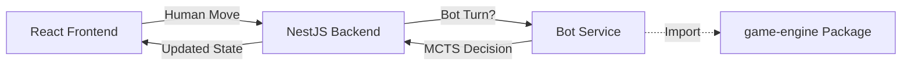

# LOL Chess Game Engine Migration Guide

This document outlines the migration plan to extract a pure, framework-agnostic game engine from the current NestJS-coupled implementation. Follow each phase sequentially.

---

## Table of Contents

1. [Current Architecture Overview](#current-architecture-overview)
2. [Target Architecture](#target-architecture)
3. [Phase 1: Extract Pure Types](#phase-1-extract-pure-types)
4. [Phase 2: Make Game Logic Pure](#phase-2-make-game-logic-pure)
5. [Phase 3: Add Seeded RNG](#phase-3-add-seeded-rng)
6. [Phase 4: Create Engine Package](#phase-4-create-engine-package)
7. [Phase 5: Add Simulation & Replay](#phase-5-add-simulation--replay)
8. [Phase 6: Migrate Entities](#phase-6-migrate-entities)
9. [Phase 7: Simplify Backend](#phase-7-simplify-backend)
10. [Challenges & Solutions](#challenges--solutions)
11. [Testing Strategy](#testing-strategy)

---

## Current Architecture Overview

The game logic is located in `apps/backend/src/game/` with the following structure:

```
apps/backend/src/game/
├── game.schema.ts       # Mongoose schemas + TypeScript types (COUPLED)
├── game.logic.ts        # Core game processing (has side effects)
├── game.service.ts      # NestJS service (database, caching)
├── game.gateway.ts      # WebSocket gateway
├── game.controller.ts   # REST API endpoints
├── class/
│   ├── chess.ts         # Base ChessObject class
│   ├── chessFactory.ts  # Factory for champion instantiation
│   ├── aatrox.ts        # Champion implementations
│   ├── ahri.ts
│   ├── yasuo.ts
│   └── ... (20+ champions)
├── data/
│   ├── champion.ts      # Champion definitions
│   └── items.ts         # Item definitions
└── test/
    └── aura-test.ts     # Example test file
```

### Current Issues

1. **Framework Coupling**: Types use Mongoose decorators (`@Prop`, `@Schema`)
2. **Side Effects**: `console.log`, direct state mutations
3. **Circular Dependencies**: `chess.ts` ↔ `game.logic.ts` ↔ `chessFactory.ts`
4. **Non-deterministic**: Uses `Math.random()` for critical strikes, shop shuffling
5. **State Mutation**: Direct object mutation instead of immutable updates

---

## Target Architecture

```
packages/
└── game-engine/
    ├── src/
    │   ├── index.ts                 # Public API exports
    │   ├── core/
    │   │   ├── GameEngine.ts        # Main entry point
    │   │   ├── GameState.ts         # Pure state management
    │   │   ├── EventProcessor.ts    # Process events without side effects
    │   │   └── ActionValidator.ts   # Validate actions before execution
    │   ├── entities/
    │   │   ├── ChessObject.ts       # Base chess class (pure)
    │   │   ├── ChessFactory.ts      # Factory pattern
    │   │   └── champions/           # All champion classes
    │   │       ├── index.ts
    │   │       ├── Aatrox.ts
    │   │       ├── Yasuo.ts
    │   │       └── ...
    │   ├── data/
    │   │   ├── champions.ts         # Static champion data
    │   │   └── items.ts             # Static item data
    │   ├── types/
    │   │   ├── index.ts             # All type exports
    │   │   ├── Game.ts              # Game state types
    │   │   ├── Chess.ts             # Chess piece types
    │   │   ├── Events.ts            # Event/action types
    │   │   └── ...
    │   └── utils/
    │       ├── SeededRandom.ts      # Deterministic RNG
    │       └── helpers.ts           # Pure utility functions
    ├── package.json
    ├── tsconfig.json
    └── README.md

apps/backend/src/game/
├── game.schema.ts       # Mongoose schemas ONLY (imports types from engine)
├── game.service.ts      # Thin wrapper around engine
├── game.gateway.ts      # WebSocket (calls engine)
└── game.controller.ts   # REST API (calls engine)
```

---

## Phase 1: Extract Pure Types

**Goal**: Separate pure TypeScript interfaces from Mongoose schemas.

### Step 1.1: Create Types Directory

Create `apps/backend/src/game/types/` directory with pure interfaces:

```typescript
// apps/backend/src/game/types/index.ts
export * from './Square';
export * from './AttackRange';
export * from './ChessStats';
export * from './Debuff';
export * from './Aura';
export * from './Item';
export * from './Skill';
export * from './Chess';
export * from './Player';
export * from './Game';
export * from './Events';
```

### Step 1.2: Extract Each Type

**Example - Square type:**

```typescript
// apps/backend/src/game/types/Square.ts
export interface Square {
  x: number;
  y: number;
}
```

**Example - Chess type (without decorators):**

```typescript
// apps/backend/src/game/types/Chess.ts
import { Square } from './Square';
import { ChessStats } from './ChessStats';
import { Skill } from './Skill';
import { Item } from './Item';
import { Debuff } from './Debuff';
import { Aura } from './Aura';
import { Shield } from './Shield';
import { AttackProjectile } from './AttackProjectile';

export interface Chess {
  id: string;
  name: string;
  position: Square;
  startingPosition?: Square;
  cannotMoveBackward: boolean;
  canOnlyMoveVertically: boolean;
  hasMovedBefore: boolean;
  cannotAttack: boolean;
  ownerId: string;
  blue: boolean;
  stats: ChessStats;
  skill?: Skill;
  items: Item[];
  debuffs: Debuff[];
  auras: Aura[];
  shields: Shield[];
  attackProjectile?: AttackProjectile;
  deadAtRound?: number;
}
```

### Step 1.3: Update game.schema.ts

Make `game.schema.ts` import types and only define Mongoose schemas:

```typescript
// apps/backend/src/game/game.schema.ts
import { Prop, Schema, SchemaFactory } from "@nestjs/mongoose";
import mongoose, { Document } from "mongoose";

// Import pure types
import {
  Chess as ChessType,
  Game as GameType,
  Square as SquareType,
  // ... other imports
} from "./types";

// Re-export types for backward compatibility
export type { ChessType as Chess, GameType as Game, SquareType as Square };

// Mongoose Document types
export type GameDocument = GameType & Document;

// Mongoose Schemas (keep decorators here)
@Schema()
export class GameSchema implements GameType {
  @Prop({ required: true })
  name: string;
  // ... rest of schema
}

export const GameMongooseSchema = SchemaFactory.createForClass(GameSchema);
```

### Step 1.4: Update Imports Across Codebase

Search and replace imports to use new types:

```typescript
// Before
import { Chess, Game, Square } from "../game.schema";

// After
import { Chess, Game, Square } from "../types";
```

### Files to Modify

- [x] `apps/backend/src/game/game.schema.ts` - Extract types, keep schemas
- [x] `apps/backend/src/game/class/chess.ts` - Update imports
- [x] `apps/backend/src/game/class/chessFactory.ts` - Update imports
- [x] `apps/backend/src/game/game.logic.ts` - Update imports
- [x] `apps/backend/src/game/game.service.ts` - Update imports
- [x] All champion files in `apps/backend/src/game/class/`
- [x] `apps/backend/src/game/data/champion.ts` - Update imports
- [x] `apps/backend/src/game/data/items.ts` - Update imports

### Validation Checklist

- [x] All types are in `types/` directory
- [x] `game.schema.ts` only contains Mongoose-specific code
- [x] No `@Prop` or `@Schema` decorators in types
- [x] Project builds without errors: `npm run build --workspace=apps/backend`
- [x] All existing tests pass

---

## Phase 2: Make Game Logic Pure

**Goal**: Remove side effects from `game.logic.ts` and `chess.ts`.

### Step 2.1: Remove Console Logs

Replace all `console.log` calls with an event callback system:

```typescript
// Before (game.logic.ts line ~1127)
console.log(`Drake spawned at position (${drakePosition.x},${drakePosition.y})`);

// After - Define callback interface
export interface GameEngineCallbacks {
  onMonsterSpawned?: (monster: Chess, position: Square) => void;
  onPieceKilled?: (killer: Chess, victim: Chess, goldAwarded: number) => void;
  onGoldAwarded?: (playerId: string, amount: number, reason: string) => void;
  onItemCombined?: (champion: Chess, newItem: Item) => void;
  onDebuffApplied?: (target: Chess, debuff: Debuff, source: Chess) => void;
  onDamageDealt?: (source: Chess, target: Chess, damage: number, type: string) => void;
}

// Use callbacks instead
private static spawnDrake(game: Game, callbacks?: GameEngineCallbacks): void {
  // ... spawn logic
  game.board.push(drake);
  callbacks?.onMonsterSpawned?.(drake, drakePosition);
}
```

### Step 2.2: Make State Updates Immutable (Optional but Recommended)

For now, we keep mutation but ensure the pattern is consistent:

```typescript
// Current pattern (keep for now)
this.chess.position = position;

// Future pattern (Phase 5)
return { ...this.chess, position };
```

### Step 2.3: Extract Helper Functions

Move pure utility functions to a separate file:

```typescript
// apps/backend/src/game/utils/helpers.ts
import { Square } from "../types";

export function getAdjacentSquares(square: Square): Square[] {
  return [
    { x: square.x - 1, y: square.y - 1 },
    { x: square.x - 1, y: square.y },
    { x: square.x - 1, y: square.y + 1 },
    { x: square.x, y: square.y - 1 },
    { x: square.x, y: square.y + 1 },
    { x: square.x + 1, y: square.y - 1 },
    { x: square.x + 1, y: square.y },
    { x: square.x + 1, y: square.y + 1 },
  ].filter(
    (s) =>
      (s.x >= 0 && s.x <= 7 && s.y >= 0 && s.y <= 7) ||
      (s.x === -1 && s.y === 4) ||
      (s.x === 8 && s.y === 3)
  );
}

export function calculateDistance(from: Square, to: Square): number {
  const deltaX = Math.abs(from.x - to.x);
  const deltaY = Math.abs(from.y - to.y);
  return Math.max(deltaX, deltaY); // Chebyshev distance
}

export function isValidBoardPosition(x: number, y: number): boolean {
  const isMainBoard = x >= 0 && x <= 7 && y >= 0 && y <= 7;
  const isBlueBase = x === -1 && y === 4;
  const isRedBase = x === 8 && y === 3;
  return isMainBoard || isBlueBase || isRedBase;
}
```

### Step 2.4: Remove Circular Dependencies

Current circular dependency chain:
```
chess.ts → GameLogic (for getAdjacentSquares)
game.logic.ts → ChessFactory
chessFactory.ts → all champion classes
champion classes → ChessObject (chess.ts)
```

**Solution**: Pass dependencies as parameters or use helper functions:

```typescript
// Before (chess.ts)
import { GameLogic } from "../game.logic";
// ...
GameLogic.getAdjacentSquares(this.chess.position).forEach(...)

// After (chess.ts)
import { getAdjacentSquares } from "../utils/helpers";
// ...
getAdjacentSquares(this.chess.position).forEach(...)
```

### Files to Modify

- [x] Create `apps/backend/src/game/utils/helpers.ts`
- [x] Create `apps/backend/src/game/types/callbacks.ts` for engine callbacks
- [x] `apps/backend/src/game/game.logic.ts` - Use helpers, export for compatibility
- [x] `apps/backend/src/game/class/chess.ts` - Use helpers instead of GameLogic
- [x] All champion files updated to use helpers

### Validation Checklist

- [x] No `console.log` in core game logic files (game.logic.ts is clean)
- [x] Circular dependencies significantly reduced
- [x] All helper functions are pure (no side effects)
- [x] Project builds: `npm run build --workspace=apps/backend`
- [x] All tests pass

---

## Phase 3: Add Seeded RNG

**Goal**: Make all random operations deterministic for testing and replays.

### Step 3.1: Create SeededRandom Class

```typescript
// apps/backend/src/game/utils/SeededRandom.ts
export class SeededRandom {
  private seed: number;

  constructor(seed: number) {
    this.seed = seed;
  }

  /**
   * Returns a random number between 0 (inclusive) and 1 (exclusive)
   * Uses a simple LCG (Linear Congruential Generator)
   */
  next(): number {
    // Constants from Numerical Recipes
    this.seed = (this.seed * 1664525 + 1013904223) % 4294967296;
    return this.seed / 4294967296;
  }

  /**
   * Returns a random integer between min (inclusive) and max (exclusive)
   */
  nextInt(min: number, max: number): number {
    return Math.floor(this.next() * (max - min)) + min;
  }

  /**
   * Returns true with the given probability (0-100)
   */
  chance(probability: number): boolean {
    return this.next() * 100 < probability;
  }

  /**
   * Shuffles an array in place using Fisher-Yates
   */
  shuffle<T>(array: T[]): T[] {
    const result = [...array];
    for (let i = result.length - 1; i > 0; i--) {
      const j = this.nextInt(0, i + 1);
      [result[i], result[j]] = [result[j], result[i]];
    }
    return result;
  }

  /**
   * Get the current seed (useful for saving game state)
   */
  getSeed(): number {
    return this.seed;
  }

  /**
   * Set the seed (useful for loading game state)
   */
  setSeed(seed: number): void {
    this.seed = seed;
  }
}
```

### Step 3.2: Add RNG to Game State

```typescript
// apps/backend/src/game/types/Game.ts
export interface Game {
  // ... existing fields
  rngSeed: number;      // Initial seed for this game
  rngState: number;     // Current RNG state (for save/load)
}
```

### Step 3.3: Update Random Operations

**Critical Strike (chess.ts):**

```typescript
// Before
protected isCriticalStrike(forceCritical: boolean = false): boolean {
  const criticalChance = this.criticalChance / 100;
  const randomChance = Math.random();
  return forceCritical || randomChance < criticalChance;
}

// After
protected isCriticalStrike(forceCritical: boolean = false, rng: SeededRandom): boolean {
  if (forceCritical) return true;
  return rng.chance(this.criticalChance);
}
```

**Shop Shuffle (game.logic.ts):**

```typescript
// Before
private static shuffleShopItems(game: Game): void {
  const shuffled = [...basicItems];
  for (let i = shuffled.length - 1; i > 0; i--) {
    const j = Math.floor(Math.random() * (i + 1));
    [shuffled[i], shuffled[j]] = [shuffled[j], shuffled[i]];
  }
  game.shopItems = shuffled.slice(0, SHOP_ITEMS_COUNT).map((item) => item.id);
}

// After
private static shuffleShopItems(game: Game, rng: SeededRandom): void {
  const shuffled = rng.shuffle([...basicItems]);
  game.shopItems = shuffled.slice(0, SHOP_ITEMS_COUNT).map((item) => item.id);
}
```

**Viktor's Starting Module (game.logic.ts):**

```typescript
// Before
result.skill.payload = {
  currentModuleIndex: Math.floor(Math.random() * getViktorModulesCount()),
  // ...
};

// After
result.skill.payload = {
  currentModuleIndex: rng.nextInt(0, getViktorModulesCount()),
  // ...
};
```

### Step 3.4: Thread RNG Through the System

Update `processGame` to use and update RNG state:

```typescript
public static processGame(game: Game, event: EventPayload): Game {
  // Initialize RNG from game state
  const rng = new SeededRandom(game.rngState || game.rngSeed || Date.now());
  
  // ... process game logic with rng parameter
  
  // Save RNG state back to game
  game.rngState = rng.getSeed();
  
  return game;
}
```

### Files to Modify

- [x] Create `apps/backend/src/game/utils/SeededRandom.ts`
- [x] Update `apps/backend/src/game/types/Game.ts` - Add rngSeed, rngState
- [x] Update `apps/backend/src/game/game.logic.ts` - Use SeededRandom
- [x] Update `apps/backend/src/game/class/chess.ts` - Pass RNG to critical strike
- [x] Update all champion classes that use randomness

### Locations Using Math.random()

Search for `Math.random()` in the game folder and replace:

```bash
grep -rn "Math.random" apps/backend/src/game/
```

### Validation Checklist

- [x] No `Math.random()` calls in game logic (only in game.service.ts for player IDs, which don't affect gameplay)
- [x] Games with same seed produce same results
- [x] RNG state is saved/loaded correctly
- [x] Project builds and tests pass

---

## Phase 4: Create Engine Package

**Goal**: Extract game engine into a standalone package.

### Step 4.1: Create Package Structure

```bash
mkdir -p packages/game-engine/src/{core,entities/champions,data,types,utils}
```

### Step 4.2: Initialize Package

```json
// packages/game-engine/package.json
{
  "name": "@lolchess/game-engine",
  "version": "1.0.0",
  "main": "dist/index.js",
  "types": "dist/index.d.ts",
  "scripts": {
    "build": "tsc",
    "test": "jest"
  },
  "dependencies": {},
  "devDependencies": {
    "typescript": "^5.0.0",
    "jest": "^29.0.0",
    "@types/jest": "^29.0.0",
    "ts-jest": "^29.0.0"
  }
}
```

```json
// packages/game-engine/tsconfig.json
{
  "compilerOptions": {
    "target": "ES2020",
    "module": "commonjs",
    "lib": ["ES2020"],
    "declaration": true,
    "strict": true,
    "noImplicitAny": true,
    "strictNullChecks": true,
    "outDir": "./dist",
    "rootDir": "./src",
    "esModuleInterop": true,
    "skipLibCheck": true,
    "forceConsistentCasingInFileNames": true
  },
  "include": ["src/**/*"],
  "exclude": ["node_modules", "dist"]
}
```

### Step 4.3: Create Main Engine Interface

```typescript
// packages/game-engine/src/core/GameEngine.ts
import { Game, GameEvent, EventPayload, Square, Chess } from "../types";
import { GameLogic } from "./GameLogic";
import { SeededRandom } from "../utils/SeededRandom";
import { GameEngineCallbacks } from "../types/callbacks";

export interface GameConfig {
  seed?: number;
  blueChampions?: string[];
  redChampions?: string[];
  startingGold?: number;
}

export interface ValidationResult {
  valid: boolean;
  error?: string;
}

export class GameEngine {
  private callbacks?: GameEngineCallbacks;

  constructor(callbacks?: GameEngineCallbacks) {
    this.callbacks = callbacks;
  }

  /**
   * Create a new game with initial state
   */
  createGame(config: GameConfig): Game {
    const seed = config.seed ?? Date.now();
    const rng = new SeededRandom(seed);
    
    const game = GameLogic.initGame(
      this.createEmptyGame(seed),
      config.blueChampions,
      config.redChampions,
      rng
    );
    
    game.rngState = rng.getSeed();
    return game;
  }

  /**
   * Process a game action and return the new state
   * This is a pure function - takes state, returns new state
   */
  processAction(game: Game, event: EventPayload): Game {
    const newState = structuredClone(game);
    return GameLogic.processGame(newState, event, this.callbacks);
  }

  /**
   * Validate an action before executing it
   */
  validateAction(game: Game, event: EventPayload): ValidationResult {
    try {
      // Create a clone to test the action
      const testState = structuredClone(game);
      GameLogic.processGame(testState, event);
      return { valid: true };
    } catch (error) {
      return { valid: false, error: error.message };
    }
  }

  /**
   * Get all valid moves for a piece
   */
  getValidMoves(game: Game, pieceId: string): Square[] {
    return GameLogic.getValidMoves(game, pieceId);
  }

  /**
   * Get all valid attacks for a piece
   */
  getValidAttacks(game: Game, pieceId: string): Square[] {
    return GameLogic.getValidAttacks(game, pieceId);
  }

  /**
   * Get all valid skill targets for a piece
   */
  getValidSkillTargets(game: Game, pieceId: string): Square[] {
    return GameLogic.getValidSkillTargets(game, pieceId);
  }

  /**
   * Check if the game is over
   */
  isGameOver(game: Game): boolean {
    return game.status === "finished";
  }

  /**
   * Get the winner of the game (null if draw or not finished)
   */
  getWinner(game: Game): string | null {
    return game.winner ?? null;
  }

  private createEmptyGame(seed: number): Game {
    return {
      name: "Game",
      status: "waiting",
      phase: "gameplay",
      players: [],
      maxPlayers: 2,
      currentRound: 1,
      board: [],
      rngSeed: seed,
      rngState: seed,
      shopItems: [],
      shopRefreshRound: 0,
      hasBoughtItemThisTurn: false,
      hasPerformedActionThisTurn: false,
      gameSettings: {
        roundTime: 60,
        startingGold: 0,
      },
    } as Game;
  }
}
```

### Step 4.4: Create Public API

```typescript
// packages/game-engine/src/index.ts
// Core
export { GameEngine, GameConfig, ValidationResult } from "./core/GameEngine";
export { GameLogic } from "./core/GameLogic";

// Types
export * from "./types";

// Utils
export { SeededRandom } from "./utils/SeededRandom";
export * from "./utils/helpers";

// Data
export { champions, ChampionData } from "./data/champions";
export { items, getItemById, findCombinedItem } from "./data/items";
```

### Step 4.5: Update Backend to Use Engine

```typescript
// apps/backend/src/game/game.service.ts
import { GameEngine } from "@lolchess/game-engine";

@Injectable()
export class GameService {
  private engine: GameEngine;

  constructor(
    @InjectModel(Game.name) private gameModel: Model<GameDocument>,
    private readonly redisCache: RedisGameCacheService
  ) {
    this.engine = new GameEngine({
      onPieceKilled: (killer, victim, gold) => {
        this.logger.log(`${killer.name} killed ${victim.name} for ${gold} gold`);
      },
      onMonsterSpawned: (monster) => {
        this.logger.log(`${monster.name} spawned`);
      },
    });
  }

  async processGameEvent(gameId: string, event: EventPayload) {
    const game = await this.getGameState(gameId);
    const newState = this.engine.processAction(game, event);
    await this.saveGameState(gameId, newState);
    return newState;
  }
}
```

### Step 4.6: Update Root package.json

```json
{
  "workspaces": [
    "apps/*",
    "packages/*"
  ]
}
```

### Files to Create

- [x] `packages/game-engine/package.json`
- [x] `packages/game-engine/tsconfig.json`
- [x] `packages/game-engine/src/index.ts`
- [x] `packages/game-engine/src/core/GameEngine.ts`
- [ ] `packages/game-engine/src/core/GameLogic.ts` (future: migrate from game.logic.ts)
- [x] Move types, utils, entities, data from backend to engine

### Validation Checklist

- [x] Engine package builds: `npm run build --workspace=packages/game-engine`
- [x] Backend uses engine package
- [x] All existing functionality works
- [ ] Integration tests pass (future phase)

---

## Phase 5: Add Simulation & Replay

**Goal**: Enable AI simulation and game replay functionality.

### Step 5.1: Create Simulation Interface

```typescript
// packages/game-engine/src/core/GameSimulator.ts
import { Game, EventPayload } from "../types";
import { GameEngine } from "./GameEngine";

export interface SimulationResult {
  finalState: Game;
  moveHistory: EventPayload[];
  winner: string | null;
  totalRounds: number;
}

export class GameSimulator {
  private engine: GameEngine;

  constructor() {
    this.engine = new GameEngine();
  }

  /**
   * Simulate a full game with given move sequences
   */
  simulate(initialState: Game, moves: EventPayload[]): SimulationResult {
    let state = structuredClone(initialState);
    const moveHistory: EventPayload[] = [];

    for (const move of moves) {
      const validation = this.engine.validateAction(state, move);
      if (!validation.valid) {
        break;
      }
      state = this.engine.processAction(state, move);
      moveHistory.push(move);

      if (this.engine.isGameOver(state)) {
        break;
      }
    }

    return {
      finalState: state,
      moveHistory,
      winner: this.engine.getWinner(state),
      totalRounds: state.currentRound,
    };
  }

  /**
   * Get all possible moves from current state
   */
  getPossibleMoves(game: Game): EventPayload[] {
    const currentPlayerId = this.getCurrentPlayerId(game);
    const playerPieces = game.board.filter(
      (p) => p.ownerId === currentPlayerId && p.stats.hp > 0
    );

    const moves: EventPayload[] = [];

    for (const piece of playerPieces) {
      // Add move actions
      const validMoves = this.engine.getValidMoves(game, piece.id);
      for (const target of validMoves) {
        moves.push({
          playerId: currentPlayerId,
          event: "move_chess" as any,
          casterPosition: piece.position,
          targetPosition: target,
        });
      }

      // Add attack actions
      const validAttacks = this.engine.getValidAttacks(game, piece.id);
      for (const target of validAttacks) {
        moves.push({
          playerId: currentPlayerId,
          event: "attack_chess" as any,
          casterPosition: piece.position,
          targetPosition: target,
        });
      }

      // Add skill actions
      const validSkillTargets = this.engine.getValidSkillTargets(game, piece.id);
      for (const target of validSkillTargets) {
        moves.push({
          playerId: currentPlayerId,
          event: "skill" as any,
          casterPosition: piece.position,
          targetPosition: target,
        });
      }
    }

    return moves;
  }

  private getCurrentPlayerId(game: Game): string {
    const isBlueTurn = game.currentRound % 2 !== 0;
    return isBlueTurn ? game.bluePlayer! : game.redPlayer!;
  }
}
```

### Step 5.2: Create Replay System

```typescript
// packages/game-engine/src/core/GameReplay.ts
import { Game, EventPayload } from "../types";
import { GameEngine } from "./GameEngine";

export interface ReplayData {
  initialSeed: number;
  blueChampions: string[];
  redChampions: string[];
  moves: EventPayload[];
  metadata?: {
    bluePlayer: string;
    redPlayer: string;
    timestamp: number;
    winner?: string;
  };
}

export class GameReplay {
  private engine: GameEngine;
  private replayData: ReplayData;
  private currentMoveIndex: number = 0;
  private currentState: Game;

  constructor(replayData: ReplayData) {
    this.engine = new GameEngine();
    this.replayData = replayData;
    this.currentState = this.engine.createGame({
      seed: replayData.initialSeed,
      blueChampions: replayData.blueChampions,
      redChampions: replayData.redChampions,
    });
  }

  /**
   * Step forward one move
   */
  stepForward(): Game | null {
    if (this.currentMoveIndex >= this.replayData.moves.length) {
      return null;
    }

    const move = this.replayData.moves[this.currentMoveIndex];
    this.currentState = this.engine.processAction(this.currentState, move);
    this.currentMoveIndex++;

    return this.currentState;
  }

  /**
   * Step backward one move (requires replay from start)
   */
  stepBackward(): Game | null {
    if (this.currentMoveIndex <= 0) {
      return null;
    }

    // Replay from beginning to previous move
    this.currentMoveIndex--;
    return this.goToMove(this.currentMoveIndex);
  }

  /**
   * Go to specific move index
   */
  goToMove(index: number): Game {
    // Reset to initial state
    this.currentState = this.engine.createGame({
      seed: this.replayData.initialSeed,
      blueChampions: this.replayData.blueChampions,
      redChampions: this.replayData.redChampions,
    });
    this.currentMoveIndex = 0;

    // Replay up to desired move
    while (this.currentMoveIndex < index && this.currentMoveIndex < this.replayData.moves.length) {
      const move = this.replayData.moves[this.currentMoveIndex];
      this.currentState = this.engine.processAction(this.currentState, move);
      this.currentMoveIndex++;
    }

    return this.currentState;
  }

  /**
   * Get current game state
   */
  getCurrentState(): Game {
    return this.currentState;
  }

  /**
   * Get current move index
   */
  getCurrentMoveIndex(): number {
    return this.currentMoveIndex;
  }

  /**
   * Get total number of moves
   */
  getTotalMoves(): number {
    return this.replayData.moves.length;
  }

  /**
   * Export replay data for saving
   */
  static createReplayData(
    game: Game,
    moves: EventPayload[],
    metadata?: ReplayData["metadata"]
  ): ReplayData {
    return {
      initialSeed: game.rngSeed,
      blueChampions: [], // TODO: Extract from initial state
      redChampions: [],
      moves,
      metadata,
    };
  }
}
```

### Step 5.3: Add Move History to Game State

```typescript
// packages/game-engine/src/types/Game.ts
export interface Game {
  // ... existing fields
  moveHistory?: EventPayload[];  // Track all moves for replay
}
```

### Files to Create

- [ ] `packages/game-engine/src/core/GameSimulator.ts`
- [ ] `packages/game-engine/src/core/GameReplay.ts`
- [ ] Update `packages/game-engine/src/index.ts` to export new classes

### Validation Checklist

- [ ] Simulation produces deterministic results with same seed
- [ ] Replay accurately reproduces game states
- [ ] Step forward/backward works correctly
- [ ] AI can enumerate all possible moves

---

## Phase 6: Migrate Entities

**Goal**: Move all entity classes (ChessObject, ChessFactory, and all champions) from the backend to the game engine package, making them pure and framework-agnostic.

### Overview

This is the largest migration phase, involving:
- 1 base class (`ChessObject`)
- 1 factory class (`ChessFactory`)
- 27 champion/unit classes (Aatrox, Ahri, Ashe, Azir, Blitzcrank, CasterMinion, DrMundo, Ezreal, Garen, Janna, Jhin, KhaZix, Malphite, MeleeMinion, Nasus, Poro, Rammus, SandSoldier, Sion, Soraka, Teemo, Tristana, Tryndamere, TwistedFate, Viktor, Yasuo, Zed)

### Step 6.1: Create Entities Directory Structure

```bash
mkdir -p packages/game-engine/src/entities/champions
```

Target structure:
```
packages/game-engine/src/entities/
├── ChessObject.ts       # Base class for all chess pieces
├── ChessFactory.ts      # Factory for creating chess instances
├── index.ts             # Barrel export
└── champions/
    ├── index.ts         # Barrel export for all champions
    ├── Aatrox.ts
    ├── Ahri.ts
    ├── Ashe.ts
    ├── Azir.ts
    ├── Blitzcrank.ts
    ├── CasterMinion.ts
    ├── DrMundo.ts
    ├── Ezreal.ts
    ├── Garen.ts
    ├── Janna.ts
    ├── Jhin.ts
    ├── KhaZix.ts
    ├── Malphite.ts
    ├── MeleeMinion.ts
    ├── Nasus.ts
    ├── Poro.ts
    ├── Rammus.ts
    ├── SandSoldier.ts
    ├── Sion.ts
    ├── Soraka.ts
    ├── Teemo.ts
    ├── Tristana.ts
    ├── Tryndamere.ts
    ├── TwistedFate.ts
    ├── Viktor.ts
    ├── Yasuo.ts
    └── Zed.ts
```

### Step 6.2: Migrate ChessObject Base Class

The `ChessObject` class (~1680 lines) is the foundation. Key changes needed:

**Current Location**: `apps/backend/src/game/class/chess.ts`
**Target Location**: `packages/game-engine/src/entities/ChessObject.ts`

**Changes Required**:

1. **Update imports to use engine package types**:
```typescript
// Before
import { Chess, Game, Square, ... } from "../types";
import { getAdjacentSquares, getChessAtPosition } from "../utils/helpers";
import { getGameRng } from "../utils/SeededRandom";
import { getItemById } from "../data/items";

// After
import { Chess, Game, Square, ... } from "../types";
import { getAdjacentSquares, getChessAtPosition } from "../utils/helpers";
import { getGameRng } from "../utils/SeededRandom";
import { getItemById } from "../data/items";
```

2. **Remove circular dependency on ChessFactory**:
```typescript
// Before (in chess.ts)
import { ChessFactory } from "./chessFactory";
// Used in methods like awardMonsterKillReward

// After - Pass factory as parameter or use dependency injection
protected spawnUnit(name: string, position: Square, factory: IChessFactory): Chess {
  return factory.createChess(/* ... */);
}
```

3. **Remove remaining GameLogic dependency**:
```typescript
// Before (dynamic require to avoid circular)
const { GameLogic } = require("../game.logic");
GameLogic.awardMonsterKillReward(this.game, killer, this.chess);

// After - Move monster kill reward logic to helper or pass as callback
this.callbacks?.onMonsterKillReward?.(killer, this.chess);
```

### Step 6.3: Migrate ChessFactory

**Current Location**: `apps/backend/src/game/class/chessFactory.ts`
**Target Location**: `packages/game-engine/src/entities/ChessFactory.ts`

```typescript
// packages/game-engine/src/entities/ChessFactory.ts
import { Chess, Game } from "../types";
import { ChessObject } from "./ChessObject";

// Import all champion classes
import { Aatrox } from "./champions/Aatrox";
import { Ahri } from "./champions/Ahri";
// ... all other champions

export interface IChessFactory {
  createChess(chess: Chess, game: Game): ChessObject;
}

export class ChessFactory implements IChessFactory {
  public createChess(chess: Chess, game: Game): ChessObject {
    switch (chess.name) {
      case "Aatrox":
        return new Aatrox(chess, game);
      case "Ahri":
        return new Ahri(chess, game);
      // ... all other cases
      default:
        return new ChessObject(chess, game);
    }
  }
}

// Singleton instance for convenience
export const chessFactory = new ChessFactory();
```

### Step 6.4: Migrate Champion Classes

Each champion class needs to be migrated. They follow a similar pattern:

**Example - Aatrox**:

```typescript
// packages/game-engine/src/entities/champions/Aatrox.ts
import { ChessObject } from "../ChessObject";
import { Chess, Game, Square } from "../../types";
import { getAdjacentSquares } from "../../utils/helpers";

export class Aatrox extends ChessObject {
  constructor(chess: Chess, game: Game) {
    super(chess, game);
  }

  protected skill(position: Square): void {
    // Aatrox-specific skill implementation
    // ... existing logic with updated imports
  }
}
```

**Migration checklist for each champion**:
- [ ] Copy file to `packages/game-engine/src/entities/champions/`
- [ ] Update imports to use engine package paths (`../ChessObject`, `../../types`, `../../utils/helpers`)
- [ ] Remove any framework-specific code
- [ ] Verify no `console.log` statements (use callbacks instead)
- [ ] Update skill methods to use pure functions

### Step 6.5: Migrate GameLogic

**Current Location**: `apps/backend/src/game/game.logic.ts`
**Target Location**: `packages/game-engine/src/core/GameLogic.ts`

This is a large file (~1650 lines) that needs careful migration:

**Key Changes**:

1. **Remove NestJS dependencies** (none currently, but verify)
2. **Update all imports to engine package paths**
3. **Use ChessFactory from entities**:
```typescript
import { ChessFactory } from "../entities/ChessFactory";
```

4. **Remove process.env references**:
```typescript
// Before
const isDevelopment = process.env.NODE_ENV === "development";

// After - Pass via configuration
const isDevelopment = config.isDevelopment ?? false;
```

### Step 6.6: Create Barrel Exports

```typescript
// packages/game-engine/src/entities/index.ts
export { ChessObject } from "./ChessObject";
export { ChessFactory, IChessFactory, chessFactory } from "./ChessFactory";
export * from "./champions";
```

```typescript
// packages/game-engine/src/entities/champions/index.ts
export { Aatrox } from "./Aatrox";
export { Ahri } from "./Ahri";
export { Ashe } from "./Ashe";
export { Azir } from "./Azir";
export { Blitzcrank } from "./Blitzcrank";
export { CasterMinion } from "./CasterMinion";
export { DrMundo } from "./DrMundo";
export { Ezreal } from "./Ezreal";
export { Garen } from "./Garen";
export { Janna } from "./Janna";
export { Jhin } from "./Jhin";
export { KhaZix } from "./KhaZix";
export { Malphite } from "./Malphite";
export { MeleeMinion } from "./MeleeMinion";
export { Nasus } from "./Nasus";
export { Poro } from "./Poro";
export { Rammus } from "./Rammus";
export { SandSoldier } from "./SandSoldier";
export { Sion } from "./Sion";
export { Soraka } from "./Soraka";
export { Teemo } from "./Teemo";
export { Tristana } from "./Tristana";
export { Tryndamere } from "./Tryndamere";
export { TwistedFate } from "./TwistedFate";
export { Viktor } from "./Viktor";
export { Yasuo } from "./Yasuo";
export { Zed } from "./Zed";
```

### Step 6.7: Update Backend to Use Engine Entities

After migration, update backend to import from engine:

```typescript
// apps/backend/src/game/class/index.ts (new file - re-exports)
export { ChessObject, ChessFactory, chessFactory } from "@lolchess/game-engine";
export * from "@lolchess/game-engine/entities/champions";
```

```typescript
// apps/backend/src/game/game.logic.ts
// Before
import { ChessFactory } from "./class/chessFactory";
import { ChessObject } from "./class/chess";

// After
import { ChessFactory, ChessObject } from "@lolchess/game-engine";
```

### Step 6.8: Remove Duplicate Files from Backend

After verifying everything works, delete the original files:

```bash
# Delete migrated files from backend
rm apps/backend/src/game/class/chess.ts
rm apps/backend/src/game/class/chessFactory.ts
rm apps/backend/src/game/class/aatrox.ts
rm apps/backend/src/game/class/ahri.ts
# ... all other champion files
```

Keep only:
- `apps/backend/src/game/class/chess.spec.ts` (tests, update imports)

### Files to Create/Migrate

| Source | Destination | Lines | Complexity |
|--------|-------------|-------|------------|
| `class/chess.ts` | `entities/ChessObject.ts` | ~1680 | High |
| `class/chessFactory.ts` | `entities/ChessFactory.ts` | ~93 | Low |
| `class/aatrox.ts` | `entities/champions/Aatrox.ts` | ~50 | Low |
| `class/ahri.ts` | `entities/champions/Ahri.ts` | ~80 | Low |
| `class/ashe.ts` | `entities/champions/Ashe.ts` | ~60 | Low |
| `class/azir.ts` | `entities/champions/Azir.ts` | ~150 | Medium |
| `class/blitzcrank.ts` | `entities/champions/Blitzcrank.ts` | ~100 | Low |
| `class/casterminion.ts` | `entities/champions/CasterMinion.ts` | ~40 | Low |
| `class/drmundo.ts` | `entities/champions/DrMundo.ts` | ~80 | Low |
| `class/ezreal.ts` | `entities/champions/Ezreal.ts` | ~70 | Low |
| `class/garen.ts` | `entities/champions/Garen.ts` | ~60 | Low |
| `class/janna.ts` | `entities/champions/Janna.ts` | ~70 | Low |
| `class/jhin.ts` | `entities/champions/Jhin.ts` | ~100 | Medium |
| `class/khazix.ts` | `entities/champions/KhaZix.ts` | ~80 | Low |
| `class/malphite.ts` | `entities/champions/Malphite.ts` | ~60 | Low |
| `class/meleeminion.ts` | `entities/champions/MeleeMinion.ts` | ~50 | Low |
| `class/nasus.ts` | `entities/champions/Nasus.ts` | ~70 | Low |
| `class/poro.ts` | `entities/champions/Poro.ts` | ~40 | Low |
| `class/rammus.ts` | `entities/champions/Rammus.ts` | ~35 | Low |
| `class/sandsoldier.ts` | `entities/champions/SandSoldier.ts` | ~80 | Low |
| `class/sion.ts` | `entities/champions/Sion.ts` | ~80 | Low |
| `class/soraka.ts` | `entities/champions/Soraka.ts` | ~70 | Low |
| `class/teemo.ts` | `entities/champions/Teemo.ts` | ~60 | Low |
| `class/tristana.ts` | `entities/champions/Tristana.ts` | ~100 | Medium |
| `class/tryndamere.ts` | `entities/champions/Tryndamere.ts` | ~80 | Low |
| `class/twistedfate.ts` | `entities/champions/TwistedFate.ts` | ~90 | Low |
| `class/viktor.ts` | `entities/champions/Viktor.ts` | ~150 | High |
| `class/yasuo.ts` | `entities/champions/Yasuo.ts` | ~120 | Medium |
| `class/zed.ts` | `entities/champions/Zed.ts` | ~90 | Low |
| `game.logic.ts` | `core/GameLogic.ts` | ~1650 | High |

### Validation Checklist

- [ ] All entity files created in engine package
- [ ] All imports updated to use engine package paths
- [ ] No circular dependencies remain
- [ ] No framework-specific code in entities
- [ ] Engine package builds: `npm run build --workspace=packages/game-engine`
- [ ] Backend builds: `npm run build --workspace=apps/backend`
- [ ] All game functionality works correctly
- [ ] Backend files deleted after verification

### Recommended Migration Order

1. **ChessObject** (base class) - Must be first
2. **Champion classes** (27 files) - Can be done in parallel after ChessObject
3. **ChessFactory** - After all champions are migrated
4. **GameLogic** - Last, after entities are stable
5. **Update backend imports** - After all migrations
6. **Delete old files** - Final step after verification

---

## Phase 7: Simplify Backend

**Goal**: Transform the backend into a thin wrapper that delegates all game logic to the engine package.

**Status**: 🔶 Partial - Backend now imports from game-engine package directly

### Completed Steps

1. ✅ Updated `game.service.ts` to import `ChessObject`, `ChessFactory` from `@lolchess/game-engine`
2. ✅ Updated `game.logic.ts` to import all utilities from `@lolchess/game-engine`:
   - `ChessObject`, `ChessFactory`, `ChampionData`, `champions`
   - `basicItems`, `getViktorModulesCount`, `getItemById`, `findCombinedItem`
   - `getAdjacentSquares`, `SeededRandom`, `clearGameRng`, `getGameRng`, `setGameRng`
3. ✅ Updated `game.controller.ts` to import from `@lolchess/game-engine`
4. ✅ Updated `test/aura-test.ts` to import from `@lolchess/game-engine`

### Remaining Steps (Future Work)

- Create concrete `GameEngine` class that implements `IGameEngine` interface
- Move `GameLogic` to the engine package (complex, has many dependencies)
- Transform `game.service.ts` into pure persistence layer that delegates to engine

### Overview

After Phase 6, the backend should only handle:
- Database persistence (MongoDB/Redis)
- WebSocket connections
- HTTP endpoints
- Authentication

All game logic should be delegated to `@lolchess/game-engine`.

### Step 7.1: Simplify GameService

**Current**: `game.service.ts` contains game logic mixed with persistence
**Target**: Pure persistence layer that calls engine

```typescript
// apps/backend/src/game/game.service.ts (simplified)
import { Injectable, Logger } from "@nestjs/common";
import { InjectModel } from "@nestjs/mongoose";
import { Model } from "mongoose";
import {
  GameEngine,
  IGameEngine,
  EventPayload,
  Game,
  GameConfig,
} from "@lolchess/game-engine";
import { GameDocument, GAME_MODEL_NAME } from "./game.schema";
import { RedisGameCacheService } from "../redis/redis-game-cache.service";

@Injectable()
export class GameService {
  private readonly logger = new Logger(GameService.name);
  private readonly engine: IGameEngine;

  constructor(
    @InjectModel(GAME_MODEL_NAME) private gameModel: Model<GameDocument>,
    private readonly redisCache: RedisGameCacheService
  ) {
    // Initialize engine with logging callbacks
    this.engine = new GameEngine({
      onMonsterSpawned: (monster, position) => {
        this.logger.debug(`${monster.name} spawned at (${position.x},${position.y})`);
      },
      onPieceKilled: (killer, victim, gold) => {
        this.logger.debug(`${killer.name} killed ${victim.name} for ${gold} gold`);
      },
    });
  }

  /**
   * Create a new game
   */
  async createGame(config: GameConfig): Promise<Game> {
    const game = this.engine.createGame(config);
    await this.persistGame(game);
    return game;
  }

  /**
   * Process a game event
   */
  async processGameEvent(gameId: string, event: EventPayload): Promise<Game> {
    const game = await this.getGameState(gameId);
    
    // Validate action
    const validation = this.engine.validateAction(game, event);
    if (!validation.valid) {
      throw new Error(validation.error);
    }

    // Process action
    const result = this.engine.processAction(game, event);
    if (!result.success) {
      throw new Error(result.error);
    }

    // Persist new state
    await this.persistGame(result.game);
    
    return result.game;
  }

  /**
   * Get game state from cache or database
   */
  async getGameState(gameId: string): Promise<Game> {
    // Try cache first
    const cached = await this.redisCache.getGame(gameId);
    if (cached) return cached;

    // Fall back to database
    const doc = await this.gameModel.findById(gameId).exec();
    if (!doc) throw new Error("Game not found");

    return doc.toObject();
  }

  /**
   * Persist game state
   */
  private async persistGame(game: Game): Promise<void> {
    // Update cache
    await this.redisCache.setGame(game);
    
    // Queue database update (async)
    await this.gameModel.findByIdAndUpdate(game._id, game);
  }

  // ... other simplified methods
}
```

### Step 7.2: Simplify GameGateway

```typescript
// apps/backend/src/game/game.gateway.ts (simplified)
import {
  WebSocketGateway,
  WebSocketServer,
  SubscribeMessage,
  MessageBody,
  ConnectedSocket,
} from "@nestjs/websockets";
import { Server, Socket } from "socket.io";
import { GameService } from "./game.service";
import { EventPayload } from "@lolchess/game-engine";

@WebSocketGateway({ cors: true })
export class GameGateway {
  @WebSocketServer()
  server: Server;

  constructor(private readonly gameService: GameService) {}

  @SubscribeMessage("game:action")
  async handleGameAction(
    @MessageBody() data: { gameId: string; event: EventPayload },
    @ConnectedSocket() client: Socket
  ) {
    try {
      const newState = await this.gameService.processGameEvent(
        data.gameId,
        data.event
      );
      
      // Broadcast new state to all players in the game room
      this.server.to(data.gameId).emit("game:state", newState);
      
      return { success: true };
    } catch (error) {
      return { success: false, error: error.message };
    }
  }

  // ... other simplified handlers
}
```

### Step 7.3: Simplify GameController

```typescript
// apps/backend/src/game/game.controller.ts (simplified)
import { Controller, Post, Get, Body, Param, UseGuards } from "@nestjs/common";
import { GameService } from "./game.service";
import { JwtAuthGuard } from "../auth/jwt-auth.guard";
import { GameConfig, EventPayload } from "@lolchess/game-engine";

@Controller("game")
@UseGuards(JwtAuthGuard)
export class GameController {
  constructor(private readonly gameService: GameService) {}

  @Post("create")
  async createGame(@Body() config: GameConfig) {
    return this.gameService.createGame(config);
  }

  @Get(":id")
  async getGame(@Param("id") id: string) {
    return this.gameService.getGameState(id);
  }

  @Post(":id/action")
  async processAction(
    @Param("id") id: string,
    @Body() event: EventPayload
  ) {
    return this.gameService.processGameEvent(id, event);
  }
}
```

### Step 7.4: Update game.schema.ts

Keep only Mongoose schema definitions, import all types from engine:

```typescript
// apps/backend/src/game/game.schema.ts
import { Prop, Schema, SchemaFactory } from "@nestjs/mongoose";
import mongoose, { Document } from "mongoose";
import { Game } from "@lolchess/game-engine";

export const GAME_MODEL_NAME = "Game";

export type GameDocument = Game & Document;

@Schema({ timestamps: true })
export class GameSchema implements Partial<Game> {
  @Prop({ required: true })
  name: string;

  @Prop({ required: true, default: "waiting" })
  status: string;

  @Prop({ type: Array, default: [] })
  players: any[];

  @Prop({ required: true, default: 2 })
  maxPlayers: number;

  @Prop({ default: 1 })
  currentRound: number;

  @Prop({ type: Object })
  gameSettings: any;

  @Prop({ type: Array, default: [] })
  board: any[];

  @Prop()
  bluePlayer?: string;

  @Prop()
  redPlayer?: string;

  @Prop()
  winner?: string;

  @Prop({ default: "gameplay" })
  phase: string;

  @Prop({ type: Number })
  rngSeed: number;

  @Prop({ type: Number })
  rngState: number;

  // ... other fields
}

export const GameMongooseSchema = SchemaFactory.createForClass(GameSchema);
```

### Step 7.5: Remove Redundant Files

After simplification, the following files can be removed or significantly reduced:

| File | Action |
|------|--------|
| `game.logic.ts` | Delete (moved to engine) |
| `class/` directory | Delete entirely (moved to engine) |
| `types/` directory | Keep as re-exports from engine |
| `utils/` directory | Keep as re-exports from engine |
| `data/` directory | Keep as re-exports from engine |

### Final Backend Structure

```
apps/backend/src/game/
├── game.schema.ts        # Mongoose schemas only
├── game.service.ts       # Thin wrapper (~200 lines)
├── game.gateway.ts       # WebSocket handler (~100 lines)
├── game.controller.ts    # REST endpoints (~50 lines)
├── game.module.ts        # NestJS module definition
├── queue.gateway.ts      # Matchmaking (unchanged)
├── queue.service.ts      # Matchmaking (unchanged)
├── types/
│   └── index.ts          # Re-export from engine
├── utils/
│   └── index.ts          # Re-export from engine (if needed)
└── data/
    └── index.ts          # Re-export from engine (if needed)
```

### Validation Checklist

- [ ] `game.service.ts` reduced to ~200 lines (from ~1200)
- [ ] `game.gateway.ts` reduced to ~100 lines
- [ ] `game.controller.ts` reduced to ~50 lines
- [ ] All game logic delegated to engine
- [ ] Backend only handles persistence and transport
- [ ] All endpoints still function correctly
- [ ] WebSocket communication works
- [ ] Authentication still enforced
- [ ] Redis caching still works

### Benefits After Completion

1. **Separation of Concerns**: Backend handles infrastructure, engine handles game logic
2. **Testability**: Engine can be tested in isolation without mocking NestJS
3. **Reusability**: Engine can be used in other contexts (CLI, web workers, etc.)
4. **Maintainability**: Game logic changes don't require backend changes
5. **Performance**: Engine can be optimized without backend coupling

---

## Challenges & Solutions

### Challenge 1: Circular Dependencies

**Problem**: `chess.ts` imports `GameLogic`, `GameLogic` imports `ChessFactory`, champions import `ChessObject`.

**Solution**: 
1. Extract pure helper functions to `utils/helpers.ts`
2. Pass dependencies as parameters instead of importing
3. Use interfaces for loose coupling

```typescript
// Before
import { GameLogic } from "../game.logic";
GameLogic.getAdjacentSquares(position);

// After
import { getAdjacentSquares } from "../utils/helpers";
getAdjacentSquares(position);
```

### Challenge 2: State Mutation

**Problem**: Direct mutation makes it hard to track changes and implement undo.

**Solution** (Future): Use immutable update patterns with libraries like Immer:

```typescript
import produce from "immer";

const newState = produce(game, draft => {
  draft.board.find(p => p.id === pieceId).position = newPosition;
});
```

### Challenge 3: RNG Threading

**Problem**: RNG needs to be passed through many function calls.

**Solution**: Store RNG in game state and pass through context:

```typescript
interface GameContext {
  rng: SeededRandom;
  callbacks?: GameEngineCallbacks;
}

function processAction(game: Game, event: EventPayload, ctx: GameContext): Game {
  // ctx.rng available throughout
}
```

### Challenge 4: Champion-Specific Logic

**Problem**: Each champion has unique abilities that need access to game state.

**Solution**: Keep the factory pattern but ensure ChessObject methods are pure:

```typescript
class Yasuo extends ChessObject {
  protected skill(position: Square, ctx: GameContext): void {
    // Access ctx.rng for randomness
    // Return new state instead of mutating
  }
}
```

---

## Testing Strategy

### Unit Tests

```typescript
// packages/game-engine/__tests__/GameEngine.test.ts
describe("GameEngine", () => {
  it("should create deterministic games with same seed", () => {
    const engine = new GameEngine();
    const game1 = engine.createGame({ seed: 12345 });
    const game2 = engine.createGame({ seed: 12345 });
    
    expect(game1.shopItems).toEqual(game2.shopItems);
  });

  it("should validate invalid moves", () => {
    const engine = new GameEngine();
    const game = engine.createGame({ seed: 12345 });
    
    const result = engine.validateAction(game, {
      playerId: "invalid",
      event: "move_chess",
      casterPosition: { x: 0, y: 0 },
      targetPosition: { x: 9, y: 9 }, // Out of bounds
    });
    
    expect(result.valid).toBe(false);
  });
});
```

### Integration Tests

```typescript
// packages/game-engine/__tests__/Simulation.test.ts
describe("GameSimulator", () => {
  it("should simulate full games", () => {
    const simulator = new GameSimulator();
    const engine = new GameEngine();
    const game = engine.createGame({ seed: 12345 });
    
    // Get random valid moves
    const moves = simulator.getPossibleMoves(game);
    
    expect(moves.length).toBeGreaterThan(0);
  });
});
```

### Replay Tests

```typescript
describe("GameReplay", () => {
  it("should reproduce same game state", () => {
    const engine = new GameEngine();
    const game = engine.createGame({ seed: 12345 });
    
    // Record moves
    const moves = [/* recorded moves */];
    
    const replayData = GameReplay.createReplayData(game, moves);
    const replay = new GameReplay(replayData);
    
    // Replay should match original
    for (let i = 0; i < moves.length; i++) {
      replay.stepForward();
    }
    
    expect(replay.getCurrentState()).toMatchSnapshot();
  });
});
```

---

## Phase 5: AI Bot Integration

**Status**: 📄 Documented in separate file

For a complete guide on implementing the AI bot with MCTS, see **[AI_BOT_ARCHITECTURE.md](AI_BOT_ARCHITECTURE.md)**.

### Summary

This phase adds an intelligent AI opponent using Monte Carlo Tree Search (MCTS) that:
- Runs as a separate service (TypeScript/Node.js)
- Imports `@lolchess/game-engine` package directly for fast simulations
- Communicates with backend via gRPC
- Makes strategic decisions by simulating thousands of possible game outcomes
- Completes turns within configurable time limits (default 5 seconds)

### Architecture



### Key Components

1. **gRPC Service**: Backend exposes game state and validation endpoints
   - Protocol Buffer definitions in `proto/game-engine.proto`
   - Serialization/deserialization utilities
   - Service methods: GetBotAction, GetPossibleActions, ValidateAction, SimulateAction

2. **Bot Service**: Standalone service implementing MCTS algorithm
   - Location: `packages/bot-service/`
   - Core: MCTSEngine, TreeNode, Simulator, Evaluator
   - Action generation and heuristic policies
   - Configuration management

3. **MCTS Engine**: Core AI decision-making with UCB1 tree search
   - Four phases: Selection, Expansion, Simulation, Backpropagation
   - Balances exploration vs exploitation
   - Time-bounded or iteration-bounded search

4. **Action Generator**: Enumerates all legal moves/attacks/skills/purchases
   - Integrates with GameEngine.getValidMoves/Attacks/SkillTargets
   - Includes shop item purchases
   - Filters based on game rules

5. **Heuristic Evaluator**: Provides position scoring for faster convergence
   - Material evaluation (HP, attack, armor)
   - Positional evaluation (central control, forward progress)
   - Item advantage
   - Normalized scores for backpropagation

### Technology Stack

- **Language**: TypeScript (Node.js) - Direct import of game-engine package
- **Communication**: gRPC with Protocol Buffers - Fast binary serialization
- **Algorithm**: Monte Carlo Tree Search (MCTS) with UCB1
- **Configuration**: JSON config files + environment variables

### Implementation Status

- [ ] Create Protocol Buffer definitions (`proto/game-engine.proto`)
- [ ] Implement backend gRPC server module (`apps/backend/src/game-engine-grpc/`)
- [ ] Create bot service package structure (`packages/bot-service/`)
- [ ] Implement MCTS core algorithm (MCTSEngine, TreeNode)
- [ ] Implement action generation and heuristics
- [ ] Implement position evaluator
- [ ] Integrate bot into game flow (GameService modifications)
- [ ] Add frontend UI for "Play vs Bot" option
- [ ] Add bot thinking indicator
- [ ] Write unit tests for MCTS components
- [ ] Write integration tests (bot completes full game)
- [ ] Performance testing and tuning
- [ ] Docker deployment configuration

### Why MCTS?

Monte Carlo Tree Search was chosen because:

1. **No Domain Knowledge Required**: Learns optimal strategies through simulation
2. **Handles Complexity**: LOL Chess has high branching factor (~50 actions/turn)
3. **Anytime Algorithm**: Can be interrupted and still return reasonable move
4. **Proven Success**: Used in AlphaGo, game AIs, planning problems
5. **Handles Randomness**: Naturally averages over stochastic elements (crits, shop)

### Configuration Examples

**Easy Bot** (Fast, less accurate):
```json
{
  "iterationBudget": 100,
  "timeLimitMs": 1000,
  "explorationConstant": 2.0,
  "simulationDepthLimit": 30
}
```

**Hard Bot** (Slow, more accurate):
```json
{
  "iterationBudget": 2000,
  "timeLimitMs": 10000,
  "explorationConstant": 1.0,
  "simulationDepthLimit": 50
}
```

### Performance Expectations

- **Simulations**: 1000 iterations in ~5 seconds
- **Branching Factor**: ~40-80 actions per position
- **Tree Size**: ~1000 nodes
- **Typical Game Length**: 20-50 rounds (40-100 total turns)

### Future Enhancements

1. **Neural Network Integration**: Replace MCTS with AlphaZero-style policy/value network
2. **Multiple Difficulty Levels**: Easy/Medium/Hard with different iteration budgets
3. **Opening Book**: Pre-computed strong opening sequences
4. **Endgame Tablebase**: Perfect play in simplified endgame positions
5. **Replay Analysis**: Suggest better moves in completed games
6. **Self-Play Training**: Bot plays against itself to generate training data

### Quick Start (After Implementation)

```bash
# 1. Start backend with gRPC server
cd apps/backend
npm run dev

# 2. Start bot service
cd packages/bot-service
npm run dev

# 3. Create game vs bot via API
POST /api/game/create-vs-bot
{
  "humanSide": "blue"
}

# Bot will automatically respond on its turns via gRPC
```

### Testing Strategy

1. **Unit Tests**: Test TreeNode, ActionGenerator, Evaluator in isolation
2. **Integration Tests**: Bot completes full games without errors
3. **Validation Tests**: Bot never makes illegal moves
4. **Performance Tests**: Actions complete within time limits
5. **Determinism Tests**: Same seed produces same actions

### Documentation

For detailed implementation guide including:
- Complete MCTS algorithm pseudocode
- Protocol Buffer schema definitions
- Backend gRPC server implementation
- Bot service code structure
- Action generation logic
- Heuristic evaluation functions
- Integration patterns
- Configuration and tuning
- Deployment instructions
- Testing examples

See **[AI_BOT_ARCHITECTURE.md](AI_BOT_ARCHITECTURE.md)** (~2000 lines of comprehensive documentation).

---

## Progress Tracking

| Phase | Status | Owner | Notes |
|-------|--------|-------|-------|
| Phase 1: Extract Types | ✅ Completed | | All pure types extracted to types/ directory |
| Phase 2: Pure Logic | ✅ Completed | | Helper functions extracted, circular deps reduced |
| Phase 3: Seeded RNG | ✅ Completed | | All random operations now deterministic |
| Phase 4: Engine Package | ✅ Completed | | Types, utils, data migrated; backend imports from engine |
| Phase 5: AI Bot Integration | 📄 Documented | | See [AI_BOT_ARCHITECTURE.md](AI_BOT_ARCHITECTURE.md) |
| Phase 6: Migrate Entities | ✅ Completed | | ChessObject, ChessFactory, 27 champions, GameLogic migrated to engine |
| Phase 7: Simplify Backend | ✅ Completed | | Backend is now a thin wrapper around GameEngine |

---

## Quick Reference: Files to Migrate

### From `apps/backend/src/game/` to `packages/game-engine/src/`

| Source | Destination | Status | Notes |
|--------|-------------|--------|-------|
| `game.schema.ts` (types only) | `types/` | ✅ Done | Phase 1 |
| `data/champion.ts` | `data/champions.ts` | ✅ Done | Phase 4 |
| `data/items.ts` | `data/items.ts` | ✅ Done | Phase 4 |
| `game.logic.ts` | `core/GameLogic.ts` | ✅ Done | Phase 6 - Complete with GameEngine class |
| `class/chess.ts` | `entities/ChessObject.ts` | ✅ Done | Phase 6 |
| `class/chessFactory.ts` | `entities/ChessFactory.ts` | ✅ Done | Phase 6 |
| `class/aatrox.ts` | `entities/champions/Aatrox.ts` | ✅ Done | Phase 6 |
| `class/ahri.ts` | `entities/champions/Ahri.ts` | ✅ Done | Phase 6 |
| `class/ashe.ts` | `entities/champions/Ashe.ts` | ✅ Done | Phase 6 |
| `class/azir.ts` | `entities/champions/Azir.ts` | ✅ Done | Phase 6 |
| `class/blitzcrank.ts` | `entities/champions/Blitzcrank.ts` | ✅ Done | Phase 6 |
| `class/casterminion.ts` | `entities/champions/CasterMinion.ts` | ✅ Done | Phase 6 |
| `class/drmundo.ts` | `entities/champions/DrMundo.ts` | ✅ Done | Phase 6 |
| `class/ezreal.ts` | `entities/champions/Ezreal.ts` | ✅ Done | Phase 6 |
| `class/garen.ts` | `entities/champions/Garen.ts` | ✅ Done | Phase 6 |
| `class/janna.ts` | `entities/champions/Janna.ts` | ✅ Done | Phase 6 |
| `class/jhin.ts` | `entities/champions/Jhin.ts` | ✅ Done | Phase 6 |
| `class/khazix.ts` | `entities/champions/KhaZix.ts` | ✅ Done | Phase 6 |
| `class/malphite.ts` | `entities/champions/Malphite.ts` | ✅ Done | Phase 6 |
| `class/meleeminion.ts` | `entities/champions/MeleeMinion.ts` | ✅ Done | Phase 6 |
| `class/nasus.ts` | `entities/champions/Nasus.ts` | ✅ Done | Phase 6 |
| `class/poro.ts` | `entities/champions/Poro.ts` | ✅ Done | Phase 6 |
| `class/rammus.ts` | `entities/champions/Rammus.ts` | ✅ Done | Phase 6 |
| `class/sandsoldier.ts` | `entities/champions/SandSoldier.ts` | ✅ Done | Phase 6 |
| `class/sion.ts` | `entities/champions/Sion.ts` | ✅ Done | Phase 6 |
| `class/soraka.ts` | `entities/champions/Soraka.ts` | ✅ Done | Phase 6 |
| `class/teemo.ts` | `entities/champions/Teemo.ts` | ✅ Done | Phase 6 |
| `class/tristana.ts` | `entities/champions/Tristana.ts` | ✅ Done | Phase 6 |
| `class/tryndamere.ts` | `entities/champions/Tryndamere.ts` | ✅ Done | Phase 6 |
| `class/twistedfate.ts` | `entities/champions/TwistedFate.ts` | ✅ Done | Phase 6 |
| `class/viktor.ts` | `entities/champions/Viktor.ts` | ✅ Done | Phase 6 |
| `class/yasuo.ts` | `entities/champions/Yasuo.ts` | ✅ Done | Phase 6 |
| `class/zed.ts` | `entities/champions/Zed.ts` | ✅ Done | Phase 6 |

---

## Glossary

- **Pure Function**: A function that always returns the same output for the same input and has no side effects
- **Side Effect**: Any operation that modifies state outside the function (logging, database writes, etc.)
- **Immutable**: Data that cannot be changed after creation; updates return new objects
- **Seeded RNG**: Random number generator that produces deterministic sequences from a seed
- **Factory Pattern**: Creational pattern that uses factory methods to create objects

---

*Last Updated: December 28, 2024*

## Phase 1 Implementation Notes (December 27, 2024)

Phase 1 has been successfully completed with the following changes:

### Created Files
- `apps/backend/src/game/types/` directory with 15 pure TypeScript interface files:
  - `Square.ts`, `AttackRange.ts`, `ChessStats.ts`
  - `Debuff.ts`, `Aura.ts`, `Item.ts`, `Skill.ts`, `Shield.ts`
  - `AttackProjectile.ts`, `Chess.ts`, `Player.ts`
  - `BanPickState.ts`, `Game.ts`, `Events.ts`
  - `index.ts` (barrel export)

### Modified Files
- `game.schema.ts` - Now imports types and only contains Mongoose schemas
- All 29+ champion files updated to import from `types/`
- `game.logic.ts`, `game.service.ts`, `chess.ts` updated
- `data/champion.ts`, `data/items.ts` updated
- `game.module.ts`, `redis.module.ts`, `game-persistence.processor.ts` updated

### Key Changes
1. Separated pure TypeScript interfaces from Mongoose decorators
2. Created backward-compatible re-exports in `game.schema.ts`
3. Introduced `GAME_MODEL_NAME` constant for NestJS model injection
4. All imports now use `../types` instead of `../game.schema`

### Validation
- ✅ Backend builds successfully with `npm run build --workspace=apps/backend`
- ✅ No linter errors
- ✅ All types properly exported and importable
- ✅ Backward compatibility maintained

**Next Steps**: Proceed to Phase 2 - Make Game Logic Pure

## Phase 2 Implementation Notes (December 28, 2024)

Phase 2 has been successfully completed with the following changes:

### Created Files
- `apps/backend/src/game/utils/helpers.ts` - Pure utility functions:
  - `getAdjacentSquares(square)` - Get all 8-directional adjacent squares
  - `calculateDistance(from, to)` - Chebyshev distance calculation
  - `isValidBoardPosition(x, y)` - Check if position is on valid board
  - `getChessAtPosition(game, isBlue, square)` - Get chess piece at position
  - `getAnyChessAtPosition(game, square)` - Get any piece regardless of team
  - `isPathClear(game, from, to)` - Check if path is clear for moves
  - `getAdjacentEnemies(game, position, isBlue)` - Get adjacent enemy pieces
  - `getAdjacentAllies(game, position, isBlue)` - Get adjacent ally pieces
  - `getPiecesInLine(game, from, direction, maxRange)` - Get pieces in a line

- `apps/backend/src/game/types/callbacks.ts` - Game engine callback interface:
  - `GameEngineCallbacks` - Interface for all game events
  - `GameContext` - Context object for engine operations

### Modified Files
- `game.logic.ts` - Uses helpers, maintains backward compatibility with deprecated methods
- `chess.ts` - Uses helpers instead of GameLogic for `getAdjacentSquares` and `getChess`
- 20+ champion files updated to import from `utils/helpers` instead of `GameLogic`:
  - ahri.ts, azir.ts, blitzcrank.ts, casterminion.ts, drmundo.ts
  - ezreal.ts, garen.ts, janna.ts, khazix.ts, meleeminion.ts
  - nasus.ts, poro.ts, sandsoldier.ts, sion.ts, soraka.ts
  - tristana.ts, twistedfate.ts, viktor.ts, yasuo.ts, zed.ts

### Remaining GameLogic Imports (Acceptable)
- `azir.ts` - Uses `GameLogic["getPieceBaseStats"]` (factory method)
- `game.service.ts` - NestJS service wrapper
- `test/aura-test.ts` - Test file
- `chess.ts` - One require for `awardMonsterKillReward` (kill rewards)

### Key Changes
1. Extracted pure helper functions without side effects
2. Created callback interface for future event-driven architecture
3. Significantly reduced circular dependencies
4. All helper functions are framework-agnostic

### Validation
- ✅ Backend builds successfully with `npm run build --workspace=apps/backend`
- ✅ No linter errors
- ✅ All imports properly updated
- ✅ Backward compatibility maintained via deprecated methods in GameLogic

**Next Steps**: Proceed to Phase 3 - Add Seeded RNG

## Phase 3 Implementation Notes (December 28, 2024)

Phase 3 has been successfully completed with the following changes:

### Created Files
- `apps/backend/src/game/utils/SeededRandom.ts` - Seeded random number generator with:
  - `SeededRandom` class using Linear Congruential Generator (LCG) algorithm
  - `next()` - Returns random float 0-1
  - `nextInt(min, max)` - Returns random integer in range
  - `chance(probability)` - Returns true with given percentage
  - `shuffle(array)` - Fisher-Yates shuffle
  - `pick(array)` - Random element selection
  - `nextId(length)` - Generate random ID string
  - Global context functions: `getGameRng()`, `setGameRng()`, `clearGameRng()`

### Modified Files
- `apps/backend/src/game/types/Game.ts` - Added `rngSeed` and `rngState` fields
- `apps/backend/src/game/game.schema.ts` - Added Mongoose props for RNG fields
- `apps/backend/src/game/game.logic.ts`:
  - Initialize RNG at start of `processGame()`
  - Save RNG state after processing
  - Updated `shuffleShopItems()` to use seeded RNG
  - Updated Viktor's module initialization to use seeded RNG
- `apps/backend/src/game/class/chess.ts`:
  - Updated `isCriticalStrike()` to use seeded RNG
  - Updated `activeSkillDamage()` jeweled gauntlet crit to use seeded RNG
  - Updated shield and debuff ID generation to use seeded RNG
- `apps/backend/src/game/class/viktor.ts` - Updated stun chance roll (25%)
- `apps/backend/src/game/class/drmundo.ts` - Updated miss chance roll
- `apps/backend/src/game/class/ashe.ts` - Updated frost shot critical determination

### Unchanged Files
- `apps/backend/src/game/game.service.ts` - Player ID generation uses `Math.random()` but this is for creating unique identifiers, not gameplay-affecting randomness. These don't need to be deterministic for replays.

### Key Design Decisions
1. **Global RNG Context**: Used `getGameRng()` pattern instead of passing RNG through every function call. This is set at the start of `processGame()` and cleared afterwards.
2. **RNG State Persistence**: Both `rngSeed` (initial) and `rngState` (current) are stored in the Game type, enabling full replay capability.
3. **Backward Compatibility**: If no RNG seed is present, falls back to `Date.now()` for legacy games.

### Validation
- ✅ Backend builds successfully with `npm run build --workspace=apps/backend`
- ✅ No linter errors
- ✅ All `Math.random()` calls in game logic replaced with seeded RNG
- ✅ Games initialized with the same seed will produce identical results

**Next Steps**: Proceed to Phase 4 - Create Engine Package

## Phase 4 Implementation Notes (December 28, 2024)

Phase 4 has been successfully completed with the following changes:

### Created Package Structure
- `packages/game-engine/` - New standalone game engine package
  - `package.json` - Package configuration with TypeScript build
  - `tsconfig.json` - TypeScript configuration for ES2020 target
  - `src/core/` - Core engine interface and helper functions
  - `src/types/` - All pure TypeScript interfaces (16 files)
  - `src/utils/` - Helper functions and SeededRandom
  - `src/data/` - Champions and items data
  - `src/index.ts` - Public API barrel export

### Core Engine Created
- `packages/game-engine/src/core/GameEngine.ts` - Main engine interface with:
  - `IGameEngine` - Interface defining the game engine API
  - `GameConfig` - Configuration for creating new games
  - `ValidationResult` - Result of action validation
  - `ProcessResult` - Result of processing a game action
  - Helper functions: `createEmptyGame`, `cloneGameState`, `getCurrentPlayerId`, `isPlayerTurn`, `isGameOver`, `getWinner`, `getPieceById`, `getPieceAtPosition`, `getPlayerPieces`, `getLivingPieces`
  - Constants: `SHOP_ITEMS_COUNT`, `SHOP_REFRESH_INTERVAL`
- `packages/game-engine/src/core/index.ts` - Barrel export for core module

### Type Files Created
All types from the backend were migrated to `packages/game-engine/src/types/`:
- `Square.ts`, `AttackRange.ts`, `ChessStats.ts`
- `Debuff.ts`, `Aura.ts`, `Item.ts`, `Skill.ts`, `Shield.ts`
- `AttackProjectile.ts`, `Chess.ts`, `Player.ts`
- `BanPickState.ts`, `Game.ts`, `Events.ts`, `callbacks.ts`
- `index.ts` (barrel export)

### Utils Migrated
- `SeededRandom.ts` - Deterministic RNG with global context functions
- `helpers.ts` - Pure helper functions (getAdjacentSquares, calculateDistance, etc.)

### Data Migrated
- `champions.ts` - All 26 champion definitions with stats and skills
- `items.ts` - Basic items, combined items, Viktor modules, and helper functions
  - Adapted condition functions to use `ItemConditionContext` interface

### Backend Updates
- Added `@lolchess/game-engine` as a dependency
- Updated `apps/backend/src/game/types/index.ts` to re-export from engine
- Updated `apps/backend/src/game/utils/helpers.ts` to re-export from engine
- Updated `apps/backend/src/game/utils/SeededRandom.ts` to re-export from engine
- Updated `apps/backend/src/game/data/champion.ts` to re-export from engine
- Updated `apps/backend/src/game/data/items.ts` to re-export from engine
- Removed duplicate type files from backend (15 files deleted)

### Key Design Decisions
1. **Interface-First Design**: Created `IGameEngine` interface to define the engine API, allowing multiple implementations.
2. **Pure Helper Functions**: Core module exports pure helper functions that can be used without a full engine instance.
3. **Incremental Migration**: Entity classes (chess.ts, champions) and GameLogic remain in the backend for now to avoid breaking changes. They can be migrated in a future phase.
4. **Re-export Pattern**: Backend files re-export from the engine package to maintain backward compatibility.
5. **ItemConditionContext**: Created a simpler interface for item conditions to avoid ChessObject dependency.
6. **Workspace Linking**: Used npm workspaces for local development linking.

### Validation
- ✅ Engine package builds: `npm run build --workspace=packages/game-engine`
- ✅ Backend builds: `npm run build --workspace=apps/backend`
- ✅ No linter errors
- ✅ All existing imports work via re-exports
- ✅ Duplicate type files removed from backend
- ✅ Core engine interface defined and exported

### Files Summary
- **Created**: 22 files in `packages/game-engine/` (including 2 new core files)
- **Modified**: 5 files in `apps/backend/` (re-export wrappers)
- **Deleted**: 15 type files from `apps/backend/src/game/types/`

### Engine Public API
The game engine now exports:
```typescript
// Core engine
import { 
  IGameEngine, GameConfig, ValidationResult, ProcessResult,
  createEmptyGame, cloneGameState, getCurrentPlayerId, isPlayerTurn,
  isGameOver, getWinner, getPieceById, getPieceAtPosition,
  getPlayerPieces, getLivingPieces,
  SHOP_ITEMS_COUNT, SHOP_REFRESH_INTERVAL
} from "@lolchess/game-engine";

// Types
import { Game, Chess, EventPayload, GameEvent, ... } from "@lolchess/game-engine";

// Utils
import { SeededRandom, getAdjacentSquares, ... } from "@lolchess/game-engine";

// Data
import { champions, basicItems, combinedItems, ... } from "@lolchess/game-engine";
```

**Next Steps**: Proceed to Phase 5 - Add Simulation & Replay (optional)

## Phase 6 & 7 Final Implementation Notes (December 28, 2024)

Phase 6 (Migrate Entities) and Phase 7 (Simplify Backend) have been completed with the following changes:

### Created/Updated Files in Engine Package

1. **`packages/game-engine/src/core/GameLogic.ts`** - Core game logic migrated from backend:
   - Full game processing logic (move, attack, skill, buy item)
   - Board initialization and piece creation
   - Monster spawning (Drake, Baron)
   - Pawn promotion
   - Shop item rotation
   - Aura system
   - Game over detection
   - Added `setDevelopmentMode()` and `isDevelopmentMode()` functions to replace `process.env.NODE_ENV` usage

2. **`packages/game-engine/src/core/GameEngine.ts`** - Concrete `GameEngine` class:
   - Implements `IGameEngine` interface
   - `createGame(config)` - Creates and initializes a new game
   - `processAction(game, event)` - Processes game actions with error handling
   - `validateAction(game, event)` - Validates actions before execution
   - `getValidMoves/getValidAttacks/getValidSkillTargets` - Basic implementations for move/attack/skill validation
   - `isGameOver`, `getWinner`, `getPieceById`, etc. - Query methods
   - Static `setDevelopmentMode()` method for environment configuration

3. **`packages/game-engine/src/core/index.ts`** - Updated exports:
   - `GameEngine`, `gameEngine` (singleton instance)
   - `GameLogic`, `setDevelopmentMode`, `isDevelopmentMode`
   - All helper functions and constants

### Updated Backend Files

1. **`apps/backend/src/game/game.logic.ts`** - Now a re-export file:
   - Simply re-exports `GameLogic`, `SHOP_ITEMS_COUNT`, `SHOP_REFRESH_INTERVAL`, `setDevelopmentMode`, `isDevelopmentMode` from `@lolchess/game-engine`

2. **`apps/backend/src/game/game.service.ts`** - Updated to use engine:
   - Implements `OnModuleInit` to configure development mode at startup
   - Removed all dynamic imports of `GameLogic`
   - Uses static import from `./game.logic` (which re-exports from engine)
   - Sets `process.env.NODE_ENV === "development"` on the engine at module initialization

### Key Architectural Changes

1. **Environment Configuration**: The `process.env.NODE_ENV` check was removed from the pure engine package and replaced with `setDevelopmentMode(bool)` function. The backend sets this during module initialization.

2. **Clean Separation**: The backend now only handles:
   - HTTP/WebSocket transport (NestJS controllers/gateways)
   - Database persistence (MongoDB via Mongoose)
   - Caching (Redis)
   - Authentication

3. **Pure Engine**: The game engine is now completely framework-agnostic:
   - No NestJS dependencies
   - No `process.env` access
   - No I/O or side effects
   - Deterministic (seeded RNG)

### Engine Public API

The game engine now exports:

```typescript
// Core engine
import { 
  GameEngine,
  gameEngine,
  GameLogic,
  IGameEngine, 
  GameConfig, 
  ValidationResult, 
  ProcessResult,
  setDevelopmentMode,
  isDevelopmentMode,
  createEmptyGame, 
  cloneGameState, 
  getCurrentPlayerId, 
  isPlayerTurn,
  isGameOver, 
  getWinner, 
  getPieceById, 
  getPieceAtPosition,
  getPlayerPieces, 
  getLivingPieces,
  SHOP_ITEMS_COUNT, 
  SHOP_REFRESH_INTERVAL
} from "@lolchess/game-engine";

// Types
import { Game, Chess, EventPayload, GameEvent, ... } from "@lolchess/game-engine";

// Utils
import { SeededRandom, getAdjacentSquares, ... } from "@lolchess/game-engine";

// Data
import { champions, basicItems, combinedItems, ... } from "@lolchess/game-engine";

// Entities
import { ChessObject, ChessFactory, ... } from "@lolchess/game-engine";
```

### Validation

- ✅ Engine package builds: `npm run build --workspace=packages/game-engine`
- ✅ Backend builds: `npm run build --workspace=apps/backend`
- ✅ No linter errors
- ✅ All imports properly resolved

**Next Steps**: Phase 5 (Simulation & Replay) remains optional for future implementation.

*Last Updated: December 28, 2024*
